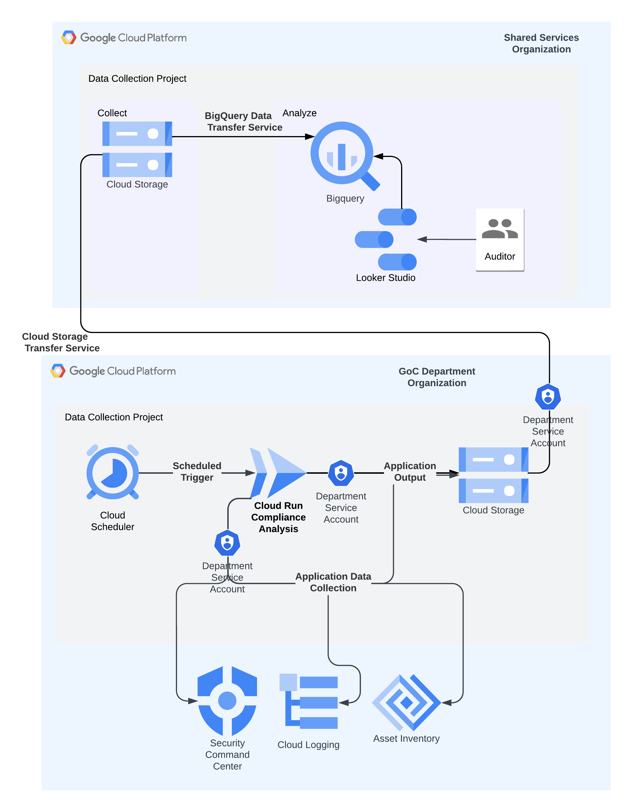
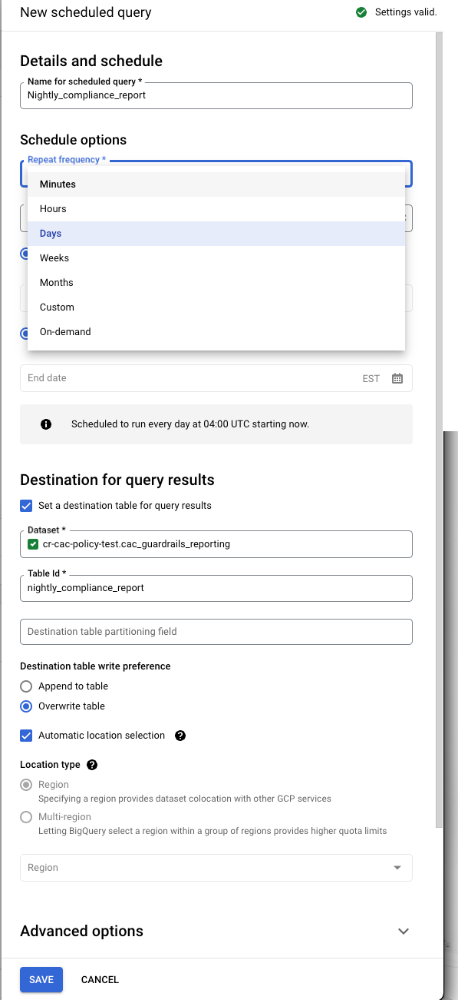

# Aggregator Environment Setup

<!-- TOC start -->
- [Aggregator Environment Setup](#aggregator-environment-setup)
  - [Setting up the Ingestion environment](#setting-up-the-ingestion-environment)
    - [Enabling Required APIs on GCP](#enabling-required-apis-on-gcp)
    - [Creating a Service Account](#creating-a-service-account)
    - [Setting Up GCS](#setting-up-gcs)
    - [Setting up BigQuery](#setting-up-bigquery)
<!-- TOC end -->

## Setting up the Ingestion environment

Client organizations that have deployed the CaC Tool in their GCP environemnt will send their results nightly to the specified Google Cloud Storage Bucket leveraging the Cloud Storage Transfer Service.

These results will be aggregated daily into a BigQuery Data set that can be visualized with Looker Studio to review the overall compliance status of each guardrail for each organization, as well as a high level view that provides an overall look at compliance.

**This is a one time setup on deployment that requires the following GCP resources:**

* GCP APIs and Services
* Cloud IAM Service Account
* GCS Bucket
* BigQuery Table and DataSet
* BigQuery Data Transfer Service

### Enabling Required APIs on GCP

1. The following APIs and services are required in the project that is receiving and aggregating the compliance result data:

* Cloud Storage API
* BigQuery API
* BigQuery Storage API
* BigQuery Migration API

        gcloud config set project  <AGGREGATE_PROJECT_ID>
        PROJECT_APIS=("bigquerydatatransfer.googleapis.com" "bigquery.googleapis.com" "storage.googleapis.com" )       
        PROJECT_ID="$(gcloud config get-value project)"
        for service in ${PROJECT_APIS[@]}; do
            gcloud services enable $service --project=$PROJECT_ID
         done

2. Verify the enabled services list

        gcloud services list

### Creating a Service Account

1. Create a new service account that will own the GCS Bucket, BigQuery DataSets and Data Transfer configurations:

        gcloud config set project <AGGREGATE_PROJECT_ID>
        PROJECT_ID="$(gcloud config get-value project)"
        SERVICE_ACCOUNT_NAME=cac-solution-policy-sa
        gcloud iam service-accounts create ${SERVICE_ACCOUNT_NAME}

2. Add the necessary permissions to the new Service Account:

        gcloud config set project <AGGREGATE_PROJECT_ID>
        PROJECT_ID="$(gcloud config get-value project)"
        SERVICE_ACCOUNT="$SERVICE_ACCOUNT_NAME@$PROJECT_ID.iam.gserviceaccount.com"
        SA_ROLES=("storage.admin" "iam.workloadIdentityUser" "bigquery.admin")
        for role in ${SA_ROLES[@]}; do 
        gcloud projects add-iam-policy-binding ${PROJECT_ID} \
        --member=serviceAccount:${SERVICE_ACCOUNT}\
        --role=roles/${role}
        done

3. Verify that the service account has the required levels of permission:

        gcloud projects get-iam-policy ${PROJECT_ID} --flatten="bindings[].members[]" --filter="bindings.members:serviceAccount"

### Setting Up GCS

1. Create a new GCS Bucket to receive the output results:

        gcloud config set project <AGGREGATE_PROJECT_ID>
        PROJECT_ID="$(gcloud config get-value project)"
        SERVICE_ACCOUNT="$SERVICE_ACCOUNT_NAME@$PROJECT_ID.iam.gserviceaccount.com"
        REGION=northamerica-northeast1
        BUCKET_NAME=cac-solution-v2-data-hub
        gsutil --impersonate-service-account="$SERVICE_ACCOUNT"  mb -l $REGION gs://$BUCKET_NAME

2. Verify Bucket Creation

        gsutil --impersonate-service-account="$SERVICE_ACCOUNT" ls -b gs://$BUCKET_NAME

### Setting up BigQuery

1. Create the BigQuery Transfer Service agent and add the required roles

        gcloud config set project <AGGREGATE_PROJECT_ID>
        PROJECT_ID="$(gcloud config get-value project)"
        PROJECT_NUMBER=$(gcloud projects list --filter="PROJECT_ID=$PROJECT_ID" --format="value(PROJECT_NUMBER)")
        gcloud beta services identity create --service=bigquerydatatransfer.googleapis.com --project=$PROJECT_NUMBER
        gcloud projects add-iam-policy-binding ${PROJECT_NUMBER} \
        --member serviceAccount:service-${PROJECT_NUMBER}@gcp-sa-bigquerydatatransfer.iam.gserviceaccount.com \
        --role roles/bigquerydatatransfer.serviceAgent

2. Verify the roles and permissions

        gcloud projects get-iam-policy ${PROJECT_NUMBER} --flatten="bindings[].members[]" --filter="bindings.role="roles/bigquerydatatransfer.serviceAgent""

3. Create the BigQuery Data Set:

         gcloud config set project <AGGREGATE_PROJECT_ID>
         PROJECT_ID="$(gcloud config get-value project)"
         SERVICE_ACCOUNT="$SERVICE_ACCOUNT_NAME@$PROJECT_ID.iam.gserviceaccount.com"
         DATASET_ID="cac_solution_results"
         gcloud config set auth/impersonate_service_account $SERVICE_ACCOUNT
         curl --request POST \
           "https://bigquery.googleapis.com/bigquery/v2/projects/$PROJECT_ID/datasets" \
           -H "Authorization: Bearer $(gcloud auth print-access-token)" \
           -H 'Accept: application/json' \
           -H 'Content-Type: application/json' \
           --data '{
             "friendlyName":"'"$DATASET_ID"'",
             "datasetReference":{
               "datasetId":"'"$DATASET_ID"'"
             },
             "description":"CaC Solution Results Dataset",
             "location":"northamerica-northeast1"
           }' \
           --compressed
        gcloud config unset auth/impersonate_service_account

4. Create the BigQuery Table and Schema:

        gcloud config set project <AGGREGATE_PROJECT_ID>
        PROJECT_ID="$(gcloud config get-value project)"
        SERVICE_ACCOUNT="$SERVICE_ACCOUNT_NAME@$PROJECT_ID.iam.gserviceaccount.com"
        DATASET_ID="cac_solution_results"
        TABLE_ID="raw_compliance_results"
        gcloud config set auth/impersonate_service_account $SERVICE_ACCOUNT
        curl --request POST \
        "https://bigquery.googleapis.com/bigquery/v2/projects/$PROJECT_ID/datasets/$DATASET_ID/tables" \
        -H "Authorization: Bearer $(gcloud auth print-access-token)" \
        --header 'Accept: application/json' \
        --header 'Content-Type: application/json' \
        --data '{
          "friendlyName":"",
          "description":"Raw Data from Compliance Testing",
          "schema":{
            "fields":[
              {"name":"tenant_domain","type":"string"},{"name":"organization","type":"string"},{"name":"status","type":"string"},{"name":"profile_level","type":"INT64"},{"name":"description","type":"string"},{"name":"asset_name","type":"string"},{"name":"msg","type":"string"},{"name":"organization_id","type":"INT64"},{"name":"guardrail","type":"INT64"},{"name":"validation","type":"string"},{"name":"check_type","type":"string"},{"name":"timestamp","type":"DATE"},{"name":"proj_parent","type":"string"},{"name":"proj_profile","type":"INT64"}]
          },
          "tableReference":{
            "datasetId":"'"$DATASET_ID"'",
            "tableId":"'"$TABLE_ID"'",
            "projectId":"'"$PROJECT_ID"'"
          }
        }' \
        --compressed

        gcloud config unset auth/impersonate_service_account

5. Create the scheduled transfer job:

        gcloud config set project <AGGREGATE_PROJECT_ID>
        PROJECT_ID="$(gcloud config get-value project)"
        SERVICE_ACCOUNT="$SERVICE_ACCOUNT_NAME@$PROJECT_ID.iam.gserviceaccount.com"
        BQ_JOB_NAME="nightly_guardrails_report"
        bq mk \
        --transfer_config \
        --project_id=${PROJECT_ID} \
        --data_source=google_cloud_storage \
        --target_dataset=$DATASET_ID \
        --display_name="${BQ_JOB_NAME}"\
        --service_account_name="${SERVICE_ACCOUNT}"\
        --params='{"data_path_template": "'"gs://${BUCKET_NAME}/*/results-*.json"'","file_format": "JSON", "destination_table_name_template":"raw_compliance_results"}'
  
   Verify the BigQuery DataSet and Transfer service setup in the GCP Console

6. Create a Scheduled Query. Sample SQL files are included in the the `sql` directory to create a number of queries related to the compliance status of organizations. The [scheduled_query](../../install_scripts/aggregator/sql/scheduled_query.sql) SQL will provided query results based on the oragnization, compliance status and its profile level.

    Use the BigQquery UI to run the query and create a Scheduled Query to run on an appropriate schedule.

    
