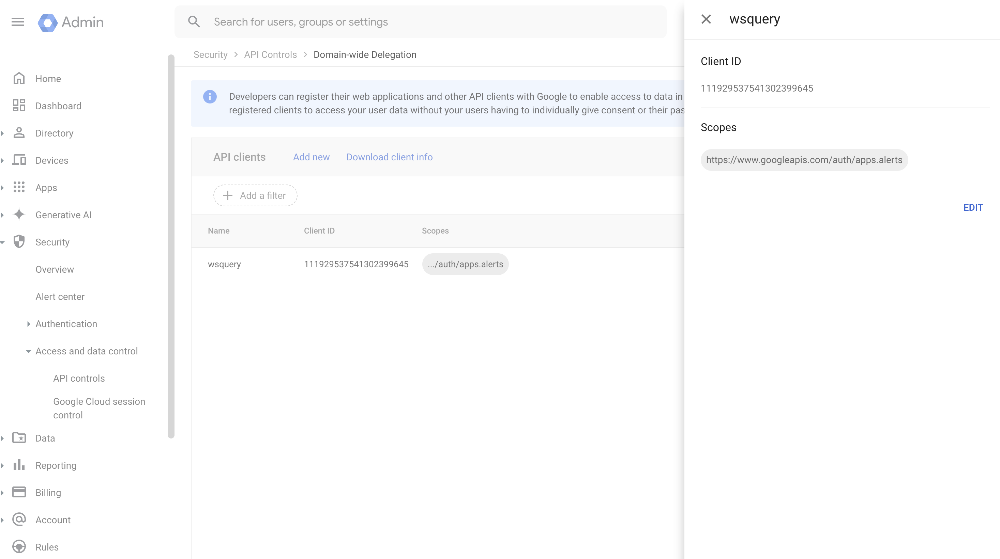
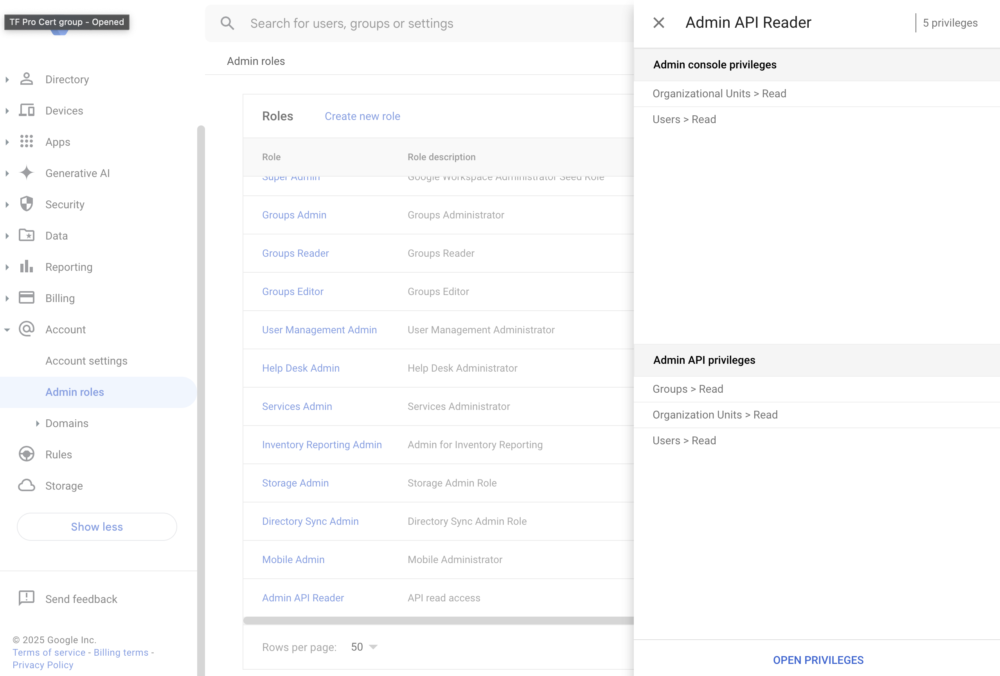

# Collector Setup Script

The collector setup script runs in the client environment and deploys all the necessary resources in an existing GCP Project to provide continuous validation of the compliance status for a GCP Organization.

<!-- TOC start -->
- [Before you begin](#before-you-begin)
- [Preparing the GCP Environment](#preparing-the-gcp-environment)
<!-- TOC end -->

## Before you begin

The CaC Solution toolkit leverages a Service Account along with several Google Cloud Platform services to create all the necessary resources as well as access the required information in a GCP Organization.

Included in this repository is a script that can be leveraged to setup all of the pre-requisites, including:

- Service Account creation, including Roles
- Project API enablement
- Service Identity Creation, including Roles

**Service Account Permissions**

--

|IAM Role                    | Description                    | Usage                                                         |Tier           |Resource Level |
|----------------------------|--------------------------------|---------------------------------------------------------------|---------------|---------------|
|Role Viewer                 |roles/iam.roleViewer            |Allows the Service Account to list the SA roles being granted. |Infrastructure |Project        |
|Storage Admin               |roles/storage.admin             |Allows the Service Account to create buckets and objects.      |Infrastructure |Project        |
|Cloud Scheduler Admin       |roles/cloudscheduler.admin      |Allows the Service Account to create a new cloud scheduler job.|Infrastructure |Project        |
|Cloud Run Developer         |roles/run.developer             |Allows the Service Account to create Cloud Run services.       |Infrastructure |Project        |
|Cloud Run Invoker           |roles/run.invoker               |Allows the Service Account to trigger Cloud Run on a Schedule  |Infrastructure |Project        |
|Logs Viewer                 |roles/logging.viewer            |Allows the Service Account to read Cloud Audit Logs            |Application    |Organization   |
|Security Center Admin Viewer|roles/securitycenter.adminViewer|Allows the Service Account to list findings and alerts in SCC  |Application    |Organization   |
|Cloud Asset Viewer          |roles/cloudasset.viewer         |Allows the Service Account to list cloud asset inventory.      |Application    |Organization   |

**Project APIs**

--

|GCP API/Service        |Description                        |Usage                                                          |Tier           |
|-----------------------|-----------------------------------|---------------------------------------------------------------|---------------|
|Cloud Run              |"run.googleapis.com"               |PaaS Environment; runs the CaC Solution Container Image        |Infrastructure |
|Container Registry     |"containerregistry.googleapis.com" |Cloud Run dependency service                                   |Infrastructure |
|Cloud Scheduler        |"cloudscheduler.googleapis.com"    |Used to trigger CaC Solution on a schedule                     |Infrastructure |
|Cloud Storage          |"storage.googleapis.com"           |Necesary for uploads of Compliance Data, and storage of results|Infrastructure |
|Cloud Asset Inventory  |"cloudasset.googleapis.com"        |Used to query provisioned GCP infrastructure                   |Application    |
|Security Command Center|"securitycenter.googleapis.com"    |Used to query provisioned GCP infrastructure                   |Application    |
|Cloud Storage Transfer |"storagetransfer.googleapis.com"   |Used to transfer Compliance results output files               |Application    |

## Preparing the GCP Environment

Run the `project_prep.sh` script found in the `collector/project_setup` directory. The script will prompt for the GCP organization name and use it to provision the Service Account and enable all of the required APIs

## Additional Workspace Permissions

In order to perform some of the queries / data collection against https://admin.google.com, some additional permissions will need to be configured.  Unfortunately, this step is not configurable programmatically.

### GCP - Configure OAuth Consent Screen
In your GCP Project --> **APIs & Services** --> **OAuth consent screen** --> **Branding**

Fill in the fields: `App name`, `User support email`, `Authorizied domains` and `Developer contact information`

`App name` is not critical -- it's just an identifier and can be anything but choose something meaningful.

The `Authorized domains` is typically your organization's domain in Workspace, although it may not be the **full** domain.  For example: `163gccspm.gccspm.gc.ca` is not accepted, but `gccspm.gc.ca` is.

### GCP - Service Account OAuth 2 Client ID
In your GCP Project --> **IAM & Admin** --> **Service accounts**

You will need to obtain the `OAuth 2 Client ID` for your service account.

### Workspace - Domain Wide Delegation
In Workspace Admin console --> **Security** --> **Access and data control** --> **API controls** --> **MANAGE DOMAIN WIDE DELEGATION**

**Add new** API client and you will be prompted for the `Client ID` (`OAuth 2 Client ID` from the step above) and `Oauth scope` for which you need to enter `https://www.googleapis.com/auth/apps.alerts`

If successful, the `Name` column should show the `App name` you configured for the OAuth Consent Screen.

### Workspace - Custom Role & Permissions
In Workspace Admin console --> **Account** --> **Admin roles** --> **Create new role**

Feel free to give the role any name you wish, but we feel **Admin API Reader** is rather fitting.

**Admin console privileges**

*Organizational Units > Read*

*Users > Read*

**Admin API privileges**

*Groups > Read*

*Organizational Units > Read*

*Users > Read*

