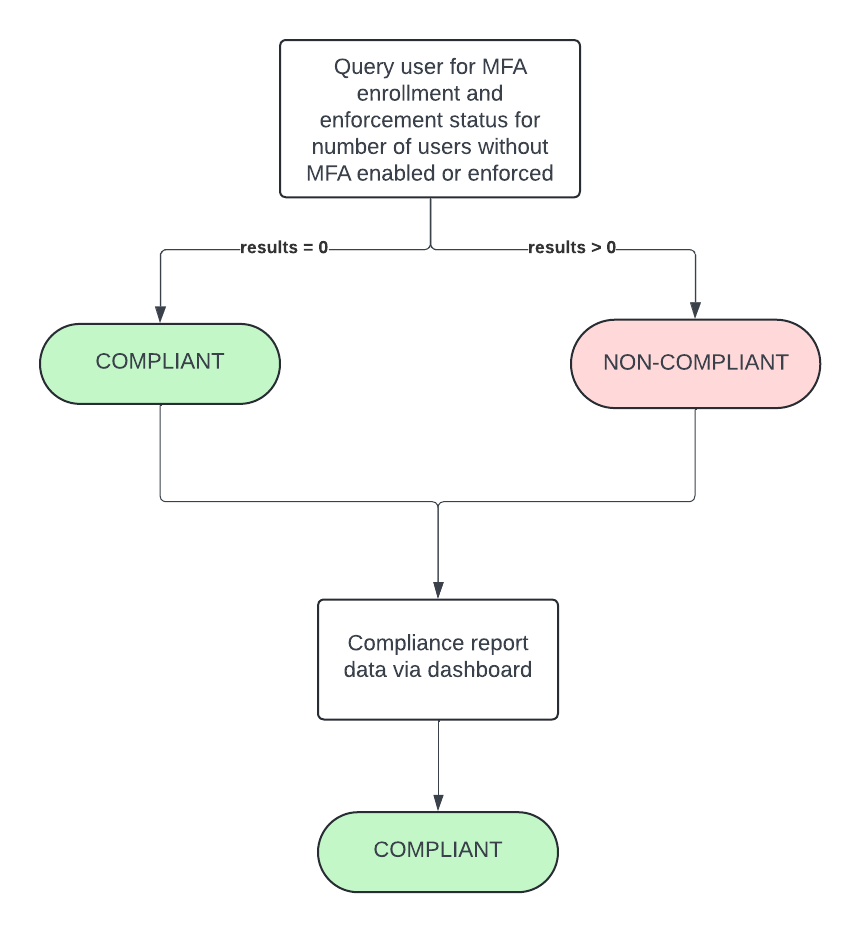
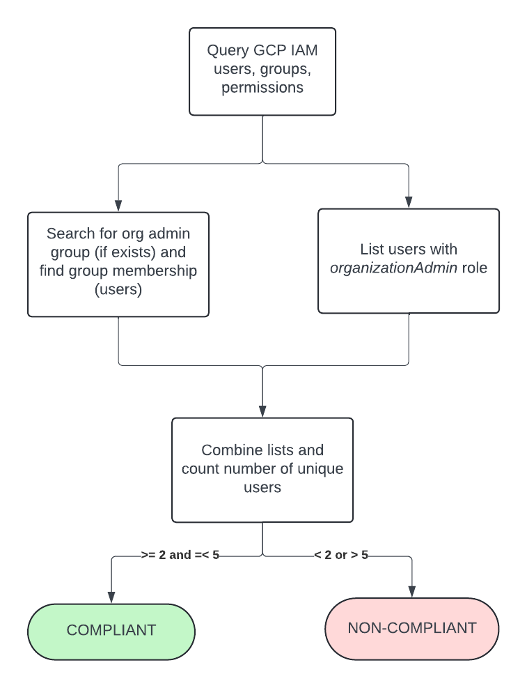
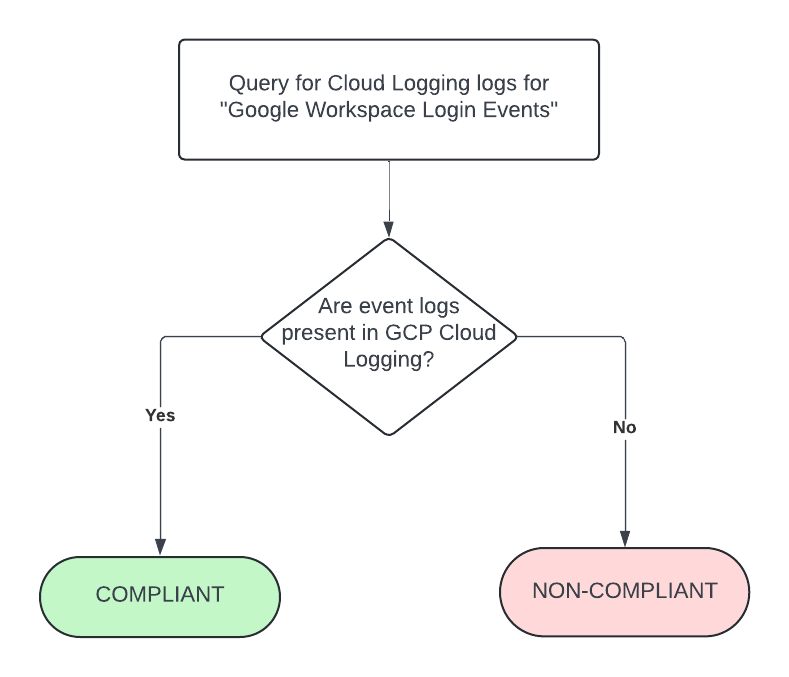
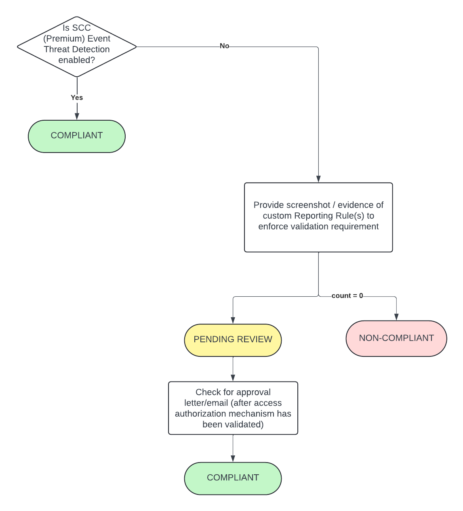
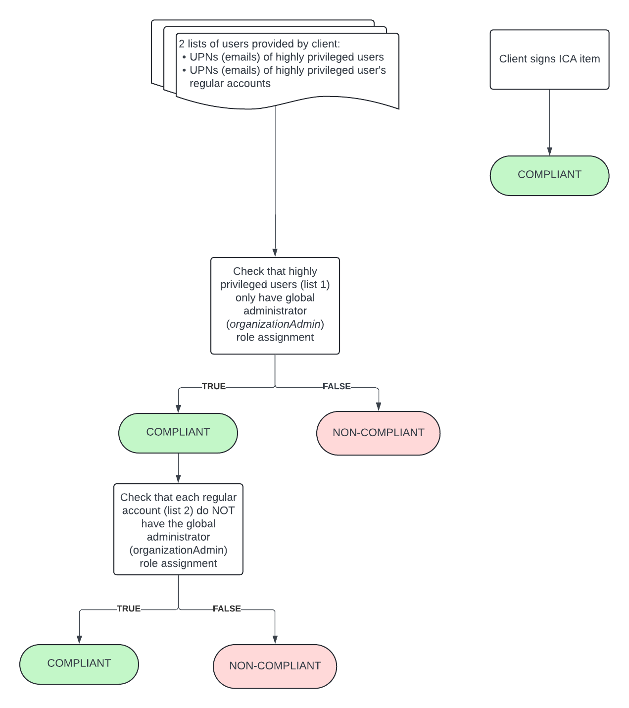

# Guardrail #01: Protect User accounts and Identities

Protect user accounts and identities.

## Mandatory Validations

- [ ] Confirm that MFA is implemented according to GC guidance through screenshots, compliance reports, or compliance checks enabled through a reporting tool for all user accounts.
- [ ] Confirm that digital policies are in place to ensure that MFA configurations are enforced.
- [ ] Confirm and report the count of registered root or global administrators (you should have at least two and no more than five).
- [ ] Confirm whether monitoring and auditing is implemented for all user accounts.
- [ ] Confirm that alerts to the authorized personnel have been implemented to flag misuse or suspicious activities for all user accounts.

## Additional Considerations

None

## Policies

### Validation 01 & 02 - MFA Enforcement

Validate MFA implemented according to GC guidance.

- [01_0102-mfa.rego](../policies/01-protect-accounts/01_0102-mfa.rego)

Query Google Workspace for user list and check whether `isEnforcedIn2Sv` is set to `true`.  The field, `isEnrolledIn2Sv` is not checked against here as it may be return false even though user is enrolled (via an external identity provider such as Azure AD)

**COMPLIANT** if all users returned have MFA enforced.

**NON-COMPLIANT** if there exists users which do not have MFA enforced.  List of users who do not have MFA enforced would be included in compliance check output.

*NOTE* List of non-compliant users (if any) will be included in validation check output

#### Policy Flow Diagram

### Validation 03 - Global Admin count

Validate number of global (organization) administrators is between 2 and 5.

- [01_03-global-admin-count.rego](../policies/01-protect-accounts/01_03-global-admin-count.rego)

Find list of users in **gcp-organization-admin@ORG_DOMAIN** group.  Find list of users with Organization Admin role assigned.  Find the set (no duplicates) of users in the combined lists and find count.

**COMPLIANT** if number of organization admins is between 2 and 5.

**NON-COMPLIANT** if number is organization admins is < 2 (too few) or > 5 (too many)

#### Policy Flow Diagram

### Validation 04 - Check for Monitoring & Audit Logs

Validate that monitoring and monitoring is implemented for all user accounts.

- [01_04-user-account-auditing.rego](../policies/01-protect-accounts/01_04-user-account-auditing.rego)

In the Admin console, you can share data from your Google Workspace, Cloud Identity, or Essentials account with services in your organization’s Google Cloud account. You can access the shared data through the Google Cloud audit logs.

The following log events data is shared with Google Cloud:

Groups Enterprise log events:

- Admin log events
- User log events

If you have Enterprise, Education Standard or Education Plus, Voice Premier, or Cloud Identity Premium edition, the following log events data is also shared with Google Cloud:

- OAuth log events
- SAML log events
- Access Transparency log events (Enterprise and Education editions only)

**COMPLIANT** if "Audited Resource" logs with `admin.googleapis.com` label are found.

**NON-COMPLIANT** if required logs are not are found.

#### Policy Flow Diagram

### Validation 05 - Ensure Alerts for Suspicious Activity have been implemented

Validate that authorized personnel are alerted when suspected misuse or suspicious activities occur for user accounts.

- [01_05-reporting-rules.rego](../policies/01-protect-accounts/01_05-reporting-rules.rego)

Enrollment in Security Command Center (SCC) Premium earns an automatic COMPLIANT status in this validation as provides Event Threat Detections.  It is not necessarily a realistic expectation that the client with have SCC Premium tier and hence this particular validation will focus on an alternative solution.

For users of Google Workspace, default built-in safety features help meet this requirement such as "Login Challenges" and "Verify-it's-you Challenges".  For many rules, automatic administrator email alerts are enabled.  However, you can also create custom Reporting Rules to meet specific criteria.

As the Alert Center API is currently v1beta1 and does not have the capability to query for Reporting Rules or its details, screenshot evidence of custom rules that have been created to enforce validation requirements.

**COMPLIANT** if document(s) uploaded to `guardrail-01` folder AND it has been reviewed and received approval. Approval is to be uploaded to `guardrail-01/validations` and filename must begin with *05_APPROVAL* (i.e. `05_APPROVAL_email.pdf`)

**PENDING** status if document(s) have been uploaded/provided but approval have not been given.

**NON-COMPLIANT** if document(s) have not been uploaded/provided.

#### Policy Flow Diagram

### Validation 06 - Dedicated Admin accounts

Validate that there are dedicated user accounts for administrative/privileged access.

- [01_06-dedicated-admin-accounts.rego](../policies/01-protect-accounts/01_06-dedicated-admin-accounts.rego)

From two client-provided lists of usernames (one privileged, one non-privileged "regular" user counterparts), this validation is to find out whether there is any overlap in privileged (organization admin) roles between the privileged and regular user accounts.

**COMPLIANT** if the provided privileged users list is a dedicated list.

**NON-COMPLIANT** if the there is a user in the regular users list that has organization admin role assigned -- which they shouldn't.

*NOTE*: ICA also required to be signed to attest/acknowledge that they have dedicated accounts for highly privileged roles

#### Policy Flow Diagram

