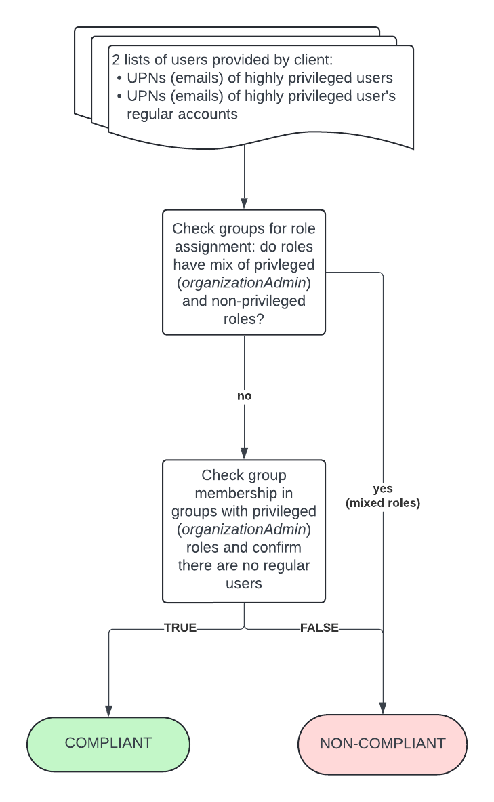

# Guardrail #02 - Manage Access

Establish access control policies and procedures for management of all accounts

## Mandatory Validations

- [ ] Demonstrate access configurations and policies are implemented for different classes of users (non-privileged, and privileged users).
- [ ] Confirm that the access authorization mechanisms have been implemented to:
  - Uniquely identify and authenticate users to the cloud service
  - Validating that the least privilege role is assigned
  - Validating that Role Based Access is implemented
  - terminate role assignment upon job change or termination
  - Perform periodic reviews of role assignment (minimum yearly)
  - Disable default and dormant accounts
  - Avoid using of user generic accounts.
- [ ] Verify that a review of role assignment for root or global administrator accounts is performed at least every 12 months.
- [ ] Demonstrate that built-in roles on cloud platforms are configured for least privilege. Custom roles can be used but a rationale should be documented and approved.
Change default passwords in accordance with the GC Password Guidance.
- [ ] Confirm that the default passwords have been changed for all the built-in accounts for the cloud service.
Configure the default password policy in accordance with GC Password Guidance.
- [ ] Demonstrate that password policy for the cloud platform has been configured according to the Password Guidance by:
  - requiring passwords that are at least 12 characters long without a maximum length limit
  - countering online guessing or brute force of passwords using throttling, account lockout policies, monitoring and multi-factor authentication
  - protecting against offline attacks using effective hashing, salting and keyed hashing.
- [ ] Confirm that mechanisms, such as throttling, account lock out policies, monitoring and risk-based authentication, to protect against password brute force attacks have been implemented.
- [ ] Confirm that only required guest user accounts are enabled (according to the business requirements of the service)
- [ ] Provide a list of non-organizational users with elevated privileges.
- [ ] Verify that reviews of guest access are performed periodically.

## Additional Considerations

- [ ] Confirm that the access control procedure for management of administrative accounts has been documented for the cloud service. The access control procedure:
  - should include provision for any guest accounts and custom accounts
  - must refer to the emergency break glass procedure
- [ ] Confirm just-in-time access for all privileged user accounts to provide time-based and approval-based role activation.
- [ ] Provide evidence that attribute-based access control mechanisms are in place to restrict access based on attributes or signals, such as authentication factors, devices issued and managed by the GC, device compliance, sign-in and user risks, and location.
- [ ] Provide evidence that all role activation for privileged user accounts require approval, and that privilege elevation is temporary (time-bound).

## Policies

### Validation 01 - Access Configuration & Policies

Validate that privileged and regular user accounts each have different levels of access/roles

- [02_01-access-config.rego](../policies/02-mgmt-admin-privileges/02_01-access-config.rego)

To validate for this we are checking groups for mix of privileged (organization admin) roles and non-privileged roles.  We are also checking to ensure the privileged groups do not contain regular users.

**COMPLIANT** if there are no regular users assigned any organization admin roles.

**NON-COMPLIANT** if regular users are found to have the organization admin role.

*NOTE* this guardrail validation compliments guardrail 01, validation 06.

#### Policy Flow Diagram

### Validation 02 - Ensure Authorization Mechanisms are in place

Validate access authorization mechanisms have been implemented.

- [02_02-authorization-mechanisms.rego](../policies/02-mgmt-admin-privileges/02_02-authorization-mechanisms.rego)

Supporting documents must be provided to attest for the following to confirm that the access authorization mechanisms have been implemented:
- uniquely identify and authenticate users to the cloud service
- validating that the least privilege role is assigned
- validating that RBAC is implemented
- terminate role assignment up job change or termination
- perform periodic reviews of role assignments (min. yearly)
- disable default & dormant accounts
- avoid using of user generic accounts

**COMPLIANT** if document(s) uploaded to `guardrail-02` folder AND it has been reviewed and received approval. Approval is to be uploaded to `guardrail-02/validations` and filename must begin with *02_APPROVAL* (i.e. `02_APPROVAL_email.pdf`)

**PENDING** status if document(s) have been uploaded/provided but approval have not been given.

**NON-COMPLIANT** if document(s) have not been uploaded/provided.

#### Policy Flow Diagram

### Validation 03 - Ensure root/global admin Role Assignment Reviews are conducted

Validate role assignment reviews for global admin accounts (organization admins) are performed min. every 12 months.

- [02_03-role-assignment-review.rego](../policies/02-mgmt-admin-privileges/02_03-role-assignment-review.rego)

Document(s) to provide proof that role assignment reviews need to be uploaded for review/validation.

**COMPLIANT** if document(s) uploaded to `guardrail-02` folder AND it has been reviewed and received approval. Approval is to be uploaded to `guardrail-02/validations` and filename must begin with *03_APPROVAL* (i.e. `03_APPROVAL_email.pdf`)

**PENDING** status if document(s) have been uploaded/provided but approval have not been given.

**NON-COMPLIANT** if document(s) have not been uploaded/provided.

*NOTE*: ICA also required to be signed to attest/acknowledge the requirement and that regular testing is being conducted.

#### Policy Flow Diagram

### Validation 04 - Demonstrate that Built-in & Custom Roles are Configured for Least Privilege

Validate built-in and custom roles following Principle of Least Privilege.

To achieve **COMPLIANT** status, ICA is to be signed by the client also required to be signed to attest/acknowledge the requirement and that regular testing is being conducted.

*RECOMMENDATION* is to leverage Google's [Privileged Access Manager (PAM)](https://cloud.google.com/iam/docs/pam-overview) to implement and control just-in-time temporary privilege elevation.  Leverage Google's [Principal Access Boundary](https://cloud.google.com/iam/docs/principal-access-boundary-policies) to limit the resources that principals can access.

#### Policy Flow Diagram

### Validation 05 - Confirm Default Passwords have been Changed for All Built-in accounts for GCP

Validate built-in accounts are not using default passwords.

GCP receives an automatics **COMPLIANT** status in this validation as GCP avoids the use of built-in accounts (i.e. root accounts in AWS)

#### Policy Flow Diagram

### Validation 06 - Ensure Password Policy in place

Validate password policies have been configured.

- [02_06-password-policy.rego](../policies/02-mgmt-admin-privileges/02_06-password-policy.rego)
  
Screenshot of configured Password Management options as evidence for attestation must be uploaded/provided to GCS bucket for review/approval.

**COMPLIANT** if document(s) uploaded to `guardrail-02` folder AND it has been reviewed and received approval. Approval is to be uploaded to `guardrail-02/validations` and filename must begin with *06_APPROVAL* (i.e. `06_APPROVAL_email.pdf`)

**PENDING** status if document(s) have been uploaded/provided but approval have not been given.

**NON-COMPLIANT** if document(s) have not been uploaded/provided.

#### Policy Flow Diagram

### Validation 07 - Confirm Mechanisms to Protect Against Password Brute Force Attacks have been implemented

Validate existence of policies to protect against brute force against brute force password attacks with mechanisms such as:
- throttling
- account lock out
- monitoring
- risk-based authentication

GCP receives an automatics **COMPLIANT** status in this validation as Google Workspace has default built-in safety features which meat this requirement such as "Login Challenges" triggered by suspicious activity (i.e. logging in from locations or at times that fall outside of user's standard pattern).  "Verify-it's-you Challenges" are issued whenever user is performing a sensitive action.  There are additional security features such as account lock out policies, but not all are configurable/customizable.

#### Policy Flow Diagram

### Validation 08 - Guest User Access

Validate list of non-organization users (if any) with elevated privileges is provided.

*NOTE* this validation compliments guardrail 02, validation 09

- [02_08-guest-accounts.rego](../policies/02-mgmt-admin-privileges/02_08-guest-accounts.rego)

The definition of "elevated" is ambiguous and cannot be baselined across all organizations, so the approach being taken is that any users NOT in an organization's cloud tenant is considered to have elevated privileges as they are guests.

Client to provide list of approved domains and denied domains

*NOTE* Guest users also may NOT be from the public domain (i.e. gmail.com, outlook.com accounts, etc.)

**COMPLIANT** if no guest accounts are being used
  
*NOTE*: ICA also required to be signed to attest/acknowledge the requirement and that regular testing is being conducted.

#### Policy Flow Diagram

### Validation 09 - List of Non-organizational Users are Reviewed

Validate list of non-organization users (if any) with elevated privileges is provided.

*NOTE* this validation compliments guardrail 02, validation 08

- [02_09-non-org-users.rego](../policies/02-mgmt-admin-privileges/02_09-non-org-users.rego)

Client must provide a list of guest users (if any)

**COMPLIANT** if no guest accounts are being used

**COMPLIANT** if document(s) uploaded to `guardrail-02` folder AND it has been reviewed and received approval. Approval is to be uploaded to `guardrail-02/validations` and filename must begin with *09_APPROVAL* (i.e. `09_APPROVAL_email.pdf`)

**PENDING** status if document(s) have been uploaded/provided but approval have not been given.

**NON-COMPLIANT** if document(s) have not been uploaded/provided.

#### Policy Flow Diagram

### Validation 10 - Guest Users Reviewed (periodically)

Validate reviews of guest access are performed periodically.

- [02_10-guest-account-reviews.rego](../policies/02-mgmt-admin-privileges/02_10-guest-account-reviews.rego)

Attestation for review performed is required to be uploaded/provided to GCS bucket for review/approval.

**COMPLIANT** if document(s) uploaded to `guardrail-02` folder AND it has been reviewed and received approval. Approval is to be uploaded to `guardrail-02/validations` and filename must begin with *10_APPROVAL* (i.e. `10_APPROVAL_email.pdf`)

**PENDING** status if document(s) have been uploaded/provided but approval have not been given.

**NON-COMPLIANT** if document(s) have not been uploaded/provided.

*NOTE* a mechanism will be included where by the approval file will be deleted after 12 months, which will trigger a **NON-COMPLIANT** status and signaling a re-review.

#### Policy Flow Diagram

