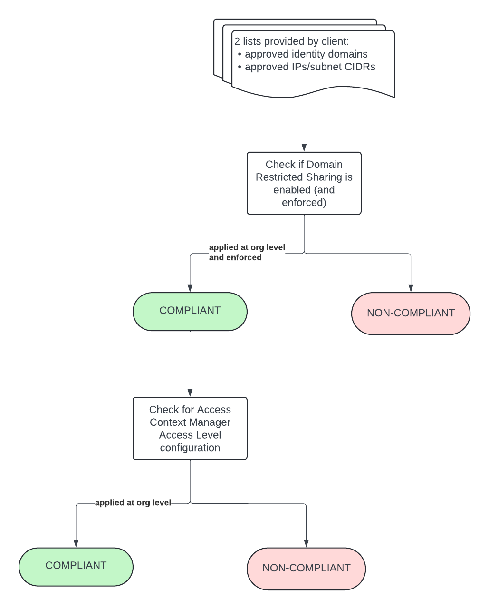
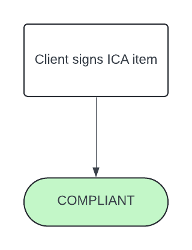

# Guardrail #03 - Secure Endpoints

Implement increased levels of protection for management interfaces.

## Mandatory Validations

- [ ] Confirm that administrative access to cloud environments is from approved and trusted locations and from devices issued and managed by the GC that enforce the Endpoint Management Configuration Requirements
- [ ] Demonstrate that access configurations and policies are implemented for devices.
  
## Additional Considerations

- [ ] Confirm whether dedicated administrative workstations are used to conduct all administrative activities

## Policies

### Validation 01 - Check for Allowed Policy Member Domains

Validate that access to cloud environment is from approved and trusted locations and from devices managed by GC

*NOTE* there are 2 parts to this validation: **restricting identities by domain**, and restricting by IP

- [03_01-policy-member-domains.rego](../policies/03-cloud-console-access/03_01-policy-member-domains.rego)

Utilizing an Organization Policy define at the organization level will restrict logins to allowed domains.

Client is to provide a list of GCP Organization and/or Workspace Customer IDs, which maps to a domain.  These values are checked against existing policy to ensure matching values.

**COMPLIANT** if provided list matches policy values.

**NON-COMPLIANT** if there are discrepancies between provided list and policy values.

#### Policy Flow Diagram

### Validation 01 - User Authentication Source IP Constraints

Validate that access to cloud environment is from approved and trusted locations and from devices managed by GC

*NOTE* there are 2 parts to this validation: restricting identities by domain, and **checking authentication source IP**

- [03_01-user-auth-source-ip.rego](https://github.com/ssc-spc-ccoe-cei/gcp-cac-policies/03-cloud-console-access/03_01-user-auth-source-ip.rego)

Client is to provide a list of allowed IPs.  These values are checked against authentication source IPs in the last 24 hours
  
**COMPLIANT** if users are federated (i.e. `HAS_FEDERATED_USERS = true`). In this scenario, the guardrail/validation conditions is behing handled by the IdP (Azure AD)

**COMPLIANT** if provided IPs match authentication source IPs 

**NON-COMPLIANT** if there are discrepancies between provided IP list and authentication source IPs.

#### Policy Flow Diagram

### Validation 02 - Demonstrate that Access Configurations & Policies are Implemented for devices

Validate that access configurations & policies are implemented for devices.

To achieve **COMPLIANT** status, ICA is to be signed by the client also required to be signed to attest/acknowledge the requirement and that configurations & policies are deployed to manage devices.

### Validation 01 - Access Context Manager IP Constraints (CURRENTLY UNUSED - POTENTIAL FUTURE CONSIDERATION)

Validate that access to cloud environment is from approved and trusted locations and from devices managed by GC

*NOTE* there are 2 parts to this validation: restricting identities by domain, and **restricting by IP**

Through Access Context Manager, fine-grained access control can be defined.  Here, the control parameter is by IP.

Client is to provide a list of allowed IP CIDRs.  These values are checked against existing policy to ensure matching values.
  
**COMPLIANT** if provided list matches policy values.

**NON-COMPLIANT** if there are discrepancies between provided list and policy values.

#### Policy Flow Diagram

### Validation 02 - Demonstrate that Access Configurations & Policies are Implemented for devices

Validate that access configurations & policies are implemented for devices.

To achieve **COMPLIANT** status, ICA is to be signed by the client also required to be signed to attest/acknowledge the requirement and that configurations & policies are deployed to manage devices.

#### Policy Flow Diagram

