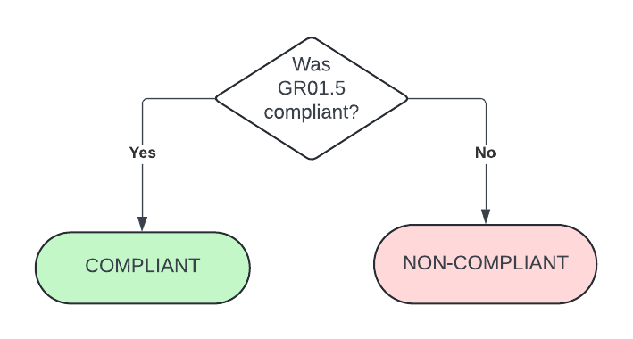

# Guardrail #04 -Enterprise Monitoring Accounts

Create role-based account to enable enterprise monitoring and visibility

## Mandatory Validations

- [ ] Verify that roles required to enable visibility in the GC have been provisioned or assigned.
- [ ] Confirm that alerts to authorized personnel have been implemented to flag misuse, suspicious sign-in attempts, or when changes are made to privileged and non-privileged accounts.

## Additional Considerations

None

## Policies

### Validation 01 - Check Monitoring Account IAM Roles

Validate that roles required to enable visibility in the GC have been provisioned/assigned.

- [04_01-monitoring-account.rego](https://github.com/ssc-spc-ccoe-cei/gcp-cac-policies/04-monitoring-account/04_01-monitoring-account.rego)

Ensure the appropriate IAM roles are assigned to a Google Cloud Group.

The roles that are being looked for are:

- *roles/resourcemanager.organizationViewer*
- *roles/billing.admin*

*NOTE* for Cloud Broker to view marketplace, it would additionally need *roles/commerceorggovernance.viewer*

**COMPLIANT** if account found with the correct roles.

**NON-COMPLIANT** if account has missing roles.

### Policy Flow Diagram

### Validation 02 - Ensure Alerts for Suspicious Activity have been implemented

Validate that roles required to enable visibility in the GC have been provisioned or assigned.

- [04_02-suspicious-activity-alerts.rego](https://github.com/ssc-spc-ccoe-cei/gcp-cac-policies/04-monitoring-account/04_02-suspicious-activity-alerts.rego)

If guardrail 01, validation 05 is compliant, then so this.  

**COMPLIANT** if guardrail 01, validation 05 is compliant.

**NON-COMPLIANT** if guardrail 01, validation 05 is NOT compliant.

### Policy Flow Diagram

