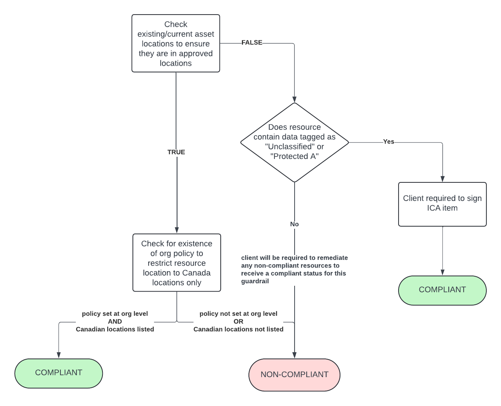

# Guardrail #05 - Data Location

Establish policies to restrict sensitive GC workloads to approved geographic locations.

## Mandatory Validations

- [ ] Demonstrate that the service location is within Canada for all Protected B cloud services where configurable, in accordance with the applicable cloud usage profiles.

## Additional Considerations

None

## Policies

### Validation 01 - Check Asset Location

Validate that for all Protected B cloud services, its location is within Canada where configurable and aligns with the applicable cloud usage profiles

[05_01-data-location.rego](https://github.com/ssc-spc-ccoe-cei/gcp-cac-policies/05-data-location/05_01-data-location.rego)

This policy will look through each resource and first check for the presence of a `location` field. If the field is not present then the resource isn't a location-based resource and can be safely ignored.

If the location field is present then the policy will check to see if the resource is `exempt`. Exempt resources exist only in a global location or can't exist in Canada. Currently, the list of exempt resources is being managed manually.

If there are resources that fall outside of approved locations (i.e. not exempt), then its location will be checked against a list of approved locations.  Also check to see if they have been tagged.  Tag key of `DATA_CLASSIFICATION` will be used.  Tag values of "**Unclassified**" or "**Protected A**" will be exempt.

**COMPLIANT** if resources are in approved locations OR if tagged with the proper key-value pair

**NON-COMPLIANT** if resources not in exempt list and not properly tagged with the appropriate `SECURITY_CATEGORY`.

#### Policy Flow Diagram

### Validation 01 - Resource Location Restriction

- [05_01-restrict-location-org-policy.rego](./05_01-restrict-location-org-policy.rego)

Google Cloud provides an organization policy that allows you to define a set of locations where location-based GCP resources can be created.
This policy allows you to specify value groups, which are collections of locations that are curated by Google to provide a simple way to define your resource locations.
One of the value groups is `in:canada-locations` which, when set, ensures that any location-based GCP resource must exist in Canada.
More information regarding value groups can be found [here](https://cloud.google.com/resource-manager/docs/organization-policy/defining-locations#value_groups).

#### Policy Flow Diagram

