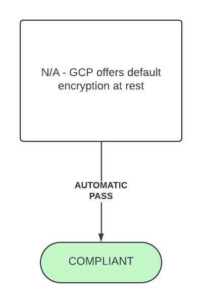
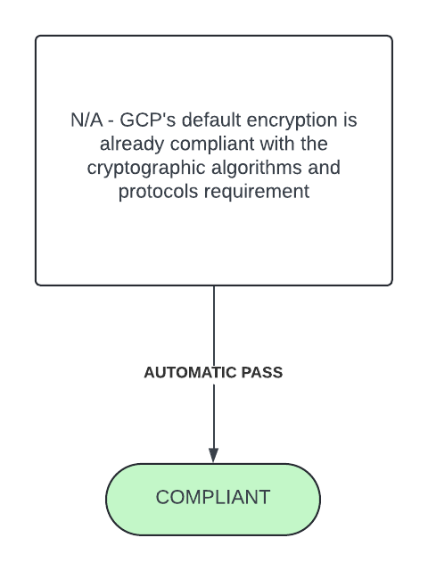

# Guardrail #06 -  Protection of Data-at-Rest

Protect data at rest by default (for example, storage) for cloud-based workloads.

## Mandatory Validations

- [ ] For IaaS and PaaS, confirm that storage service encryption is enabled for data at rest (if required based on the security risk assessment).
- [ ] For SaaS, confirm that the cloud service provider (CSP) has implemented encryption to protect customer data.
- [ ] Cryptographic algorithms and protocols configurable by the consumer are in accordance with ITSP.40.111 and ITSP.40.062.
- [ ] For SaaS, confirm that the CSP has implemented algorithms that align with ITSP.40.111 and ITSP.40.062.

## Additional Considerations

- [ ] Confirm that privacy is part of the departmental software development life cycle.
- [ ] Confirm that a key management strategy has been adopted for the cloud tenant.

## Policies

### Validation 01 - Verify Encryption Implementation to Protect Customer Data

Verify that encryption-at-rest is enabled on cloud storage to protect customer data.

- [GCP Default Encryption at Rest](https://cloud.google.com/docs/security/encryption/default-encryption)

GCP receives an automatic **COMPLIANT** status for this validation as Google encrypts all customer content at rest using one or more encryption mechanisms.  All data stored by Google is encrypted at the storage layer using AES-256 and their FIPS 140-2 validated module to implement encryption consistently across GCP.

#### Policy Flow Diagram

### Validation 02 - Verify Cryptographic Algorithms

Validate cryptographic algorithms & protocols used are in accordance with GC guidance.

- [ITSP.40.111](https://www.cyber.gc.ca/en/guidance/cryptographic-algorithms-unclassified-protected-protected-b-information-itsp40111)
- [ITSP.40.062](https://www.cyber.gc.ca/en/guidance/guidance-securely-configuring-network-protocols-itsp40062)

GCP receives an automatic **COMPLIANT** status for this validation as default GCP generated encyption keys are AES-256-GCM, which satisfies GC recommendations.  For imported keys (BYOK), keys must be AES-128 or higher, which also satisfies GC recommendations.

### Policy Flow Diagram

