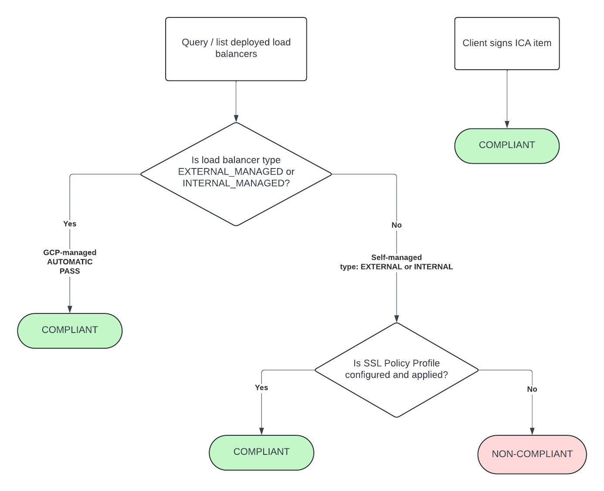
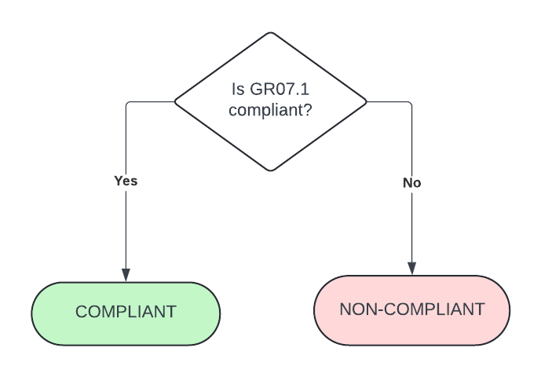
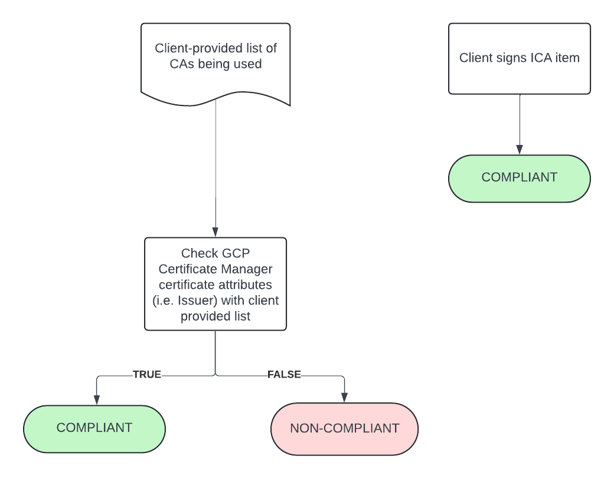

# Guardrail #07 - Protection of Data-in-Transit

Protect data transiting networks through the use of appropriate encryption and network safeguards.

## Mandatory Validations

- [ ] Confirm that TLS 1.2 or above encryption is implemented for all cloud services (via Hypertext Transfer Protocol Secure (HTTPS), TLS or another mechanism).
- [ ] Leverage cryptographic algorithms and protocols configurable by the user in accordance with ITSP.40.111 and ITSP.40.062.
- [ ] Confirm that non-person entity certificates are issued from certificate authorities that align with GC recommendations for TLS server certificates.                                                                                                                                  |

## Additional Considerations

None

## Policies

### Validation 01 & 02 - Protection of Data-in-Transit

Validate TLS 1.2 or above is being used across all cloud services and ensure self-managed services also meet TLS restriction requirements.

[07_0102-check-forwarding-rules.rego](https://github.com/ssc-spc-ccoe-cei/gcp-cac-policies/07-protect-data-in-transit/07_0102-check-forwarding-rules.rego)
[07_0102-minimum-tls-version.rego](https://github.com/ssc-spc-ccoe-cei/gcp-cac-policies/07-protect-data-in-transit/07_0102-minimum-tls-version.rego)

Google Cloud allows you to define SSL policies for SSL and TLS protocols. To define an SSL policy, you specify a minimum TLS version and a profile. The profile selects a set of SSL features to enable in the load balancer. When creating a load balancer you can set which SSL policy it will use.

Three pre-configured Google-managed profiles let you specify the level of compatibility appropriate for your application.

For optimal security, the policy will ensure any SSL policies that exist are using TLS/SSL Version 1.2 at a minimum.

It will also ensure that the same policies are set with any of the following profiles:

- `RESTRICTED` - Supports a reduced set of SSL features, intended to meet stricter compliance requirements.
- `MODERN` - Supports a wide set of SSL features, allowing modern clients to negotiate SSL.

The policy will also ensure that any load balancers that exist are using any of the approved SSL policies. Load balancers will also be divided between external and internal - as external ones have mandatory requirements to meet.

A default SSL policy that's managed by Google also exists. This policy does not meet the requirements that have been set, and there is no way for this default policy to be removed. Therefore, the policy will also check for any load balancers that are using this default SSL policy and will alert accordingly.

More information about SSL policies can be found here: [link](https://cloud.google.com/load-balancing/docs/ssl-policies-concepts).

**COMPLIANT** if SSL Policies are in place to enforce minimum TLS version and cryptographic ciphers set to `RESTRICTED` or `MODERN`. 

**NON-COMPLIANT** if required SSL Policies and TLS enforcement policies are not in place.

*NOTE*: ICA also required to be signed to attest/acknowledge the requirement and to cover the case of GCE VM instances with public IPs.

#### Policy Flow Diagram

### Validation 03 - Certificates from Approved CA Issuers

Validate certificates are issued from CAs that align with GC recommendations.

[07_03-cert-issuer.rego](https://github.com/ssc-spc-ccoe-cei/gcp-cac-policies/07-protect-data-in-transit/07_03-cert-issuer.rego)

Pull certificate data from Certificate Manager and compare Issuer with client-provided list of allowed Issuers.

**COMPLIANT** if certs all come from allowed Issuers list.

**NON-COMPLIANT** if there are certs which do not come from approved Issuers.  Outputs list of discrepant Issuers.

*NOTE*: ICA also required to be signed to attest/acknowledge the requirement and that provided CAs meet GC recommendations as per [section 2.2 of publication](https://drive.google.com/viewerng/viewer?url=https%3A%2F%2Fwiki.gccollab.ca%2Fimages%2F9%2F92%2FRecommendations_for_TLS_Server_Certificates_-_14_May_2021.pdf&embedded=true)

#### Policy Flow Diagram

