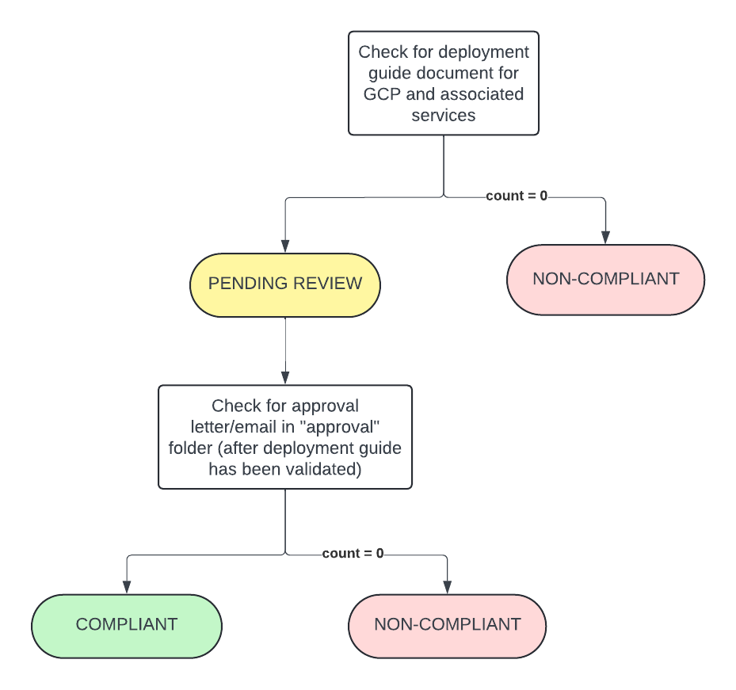

# Guardrail #08 - Segment and Separate

Segment and separate information based on sensitivity of information.

## Mandatory Requirements

- [ ] Confirm that the department has a target network architecture with a high-level design or a diagram with appropriate segmentation between network security zones in alignment with ITSP.50.104, ITSP.80.022 and ITSG-38.
- [ ] Confirm that the department has documented a deployment guide for the cloud platform and associated services (the guide should capture the landing zone if applicable)
- [ ] Confirm that the cloud service provider’s segmentation features are leveraged to provide segmentation of management, production, user acceptance testing (UAT), development (DEV) and testing (for example, the use of subscription, instances or other cloud provider constructs).

## Additional Considerations

- [ ] Leverage landing zones that include predefined, secured, multi-account support to allow automated onboarding of different workloads and teams.

## Policies

### Validation 01 - Target Network Architecture

Validate department's target network architecture has appropriate segmentation between security zones in alignment with GC guidance.

- [08_01-network-architecture-design.rego](../../policies/08-segment-and-separate/08_01-network-architecture-design.rego)

Target network architecture design/diagram to be uploaded/provided for review & approval.  Design should align with the following:
- [ITSP.50.104](https://www.cyber.gc.ca/en/guidance/itsp50104-guidance-defence-depth-cloud-based-services)
- [ITSP.80.022](https://www.cyber.gc.ca/en/guidance/baseline-security-requirements-network-security-zones-version-20-itsp80022)
- [ITSG-38](https://www.cyber.gc.ca/en/guidance/network-security-zoning-design-considerations-placement-services-within-zones-itsg-38)

**COMPLIANT** if document(s) uploaded to `guardrail-08` folder AND it has been reviewed and received approval. Approval is to be uploaded to `guardrail-08/validations` and filename must begin with *01_APPROVAL* (i.e. `01_APPROVAL_email.pdf`)

**PENDING** status if document(s) have been uploaded/provided but approval have not been given.

**NON-COMPLIANT** if document(s) have not been uploaded/provided.

#### Policy Flow Diagram

### Validation 02 - Documented Deployment Guide for Cloud Platform & Associated Services

Validate department has deployment guide documented for GCP and associated services

- [08_02-deployment-guide.rego](../policies/08-segment-and-separate/08_02-deployment-guide.rego)

Deployment guide to be uploaded/provided for review & approval.

**COMPLIANT** if document(s) uploaded to `guardrail-08` folder AND it has been reviewed and received approval. Approval is to be uploaded to `guardrail-08/validations` and filename must begin with *02_APPROVAL* (i.e. `02_APPROVAL_email.pdf`)

**PENDING** status if document(s) have been uploaded/provided but approval have not been given.

**NON-COMPLIANT** if document(s) have not been uploaded/provided.

#### Policy Flow Diagram

### Validation 03 - Ensure Use of Cloud Provider's Segmentation Features 

Validate GCP's segmentation features are leveraged to provide segmentation of management, production, UAT, DEV and testing environments.

*NOTE* this validation relies on the deployment guide in guardrail 08, validation 02.

- [08_03-provider-segmentation-features.rego](../policies/08-segment-and-separate/08_03-provider-segmentation-features.rego)

Ensure deployment guide is leveraging GCP's features to for project and environment segmentation.

**COMPLIANT** if document(s) uploaded to `guardrail-08` folder AND it has been reviewed and received approval. Approval is to be uploaded to `guardrail-08/validations` and filename must begin with *03_APPROVAL* (i.e. `03_APPROVAL_email.pdf`)

**PENDING** status if document(s) have been uploaded/provided but approval have not been given.

**NON-COMPLIANT** if document(s) have not been uploaded/provided.

#### Policy Flow Diagram

