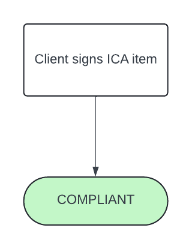
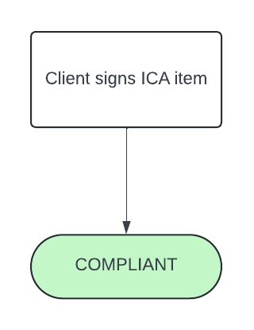
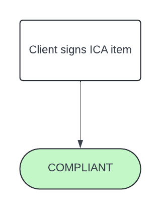
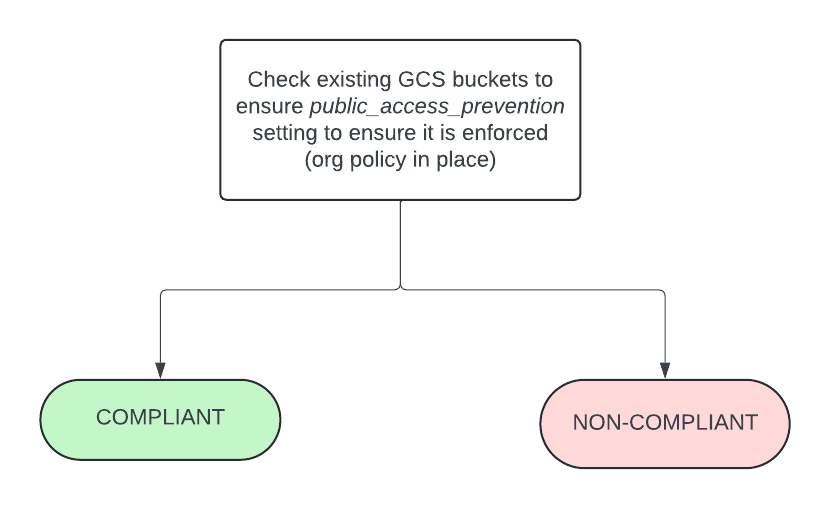

# Guardrail #09 - Network Security Services

Establish external and internal network perimeters and monitor network traffic.

## Mandatory Validations

- [ ] Confirm the policy for limiting the number of public Internet Protocols (IPs).
- [ ] Confirm the policy for network boundary protection.
- [ ] Confirm policy for limiting to authorized source IP addresses (for example, GC IP addresses)
- [ ] Confirm that storage accounts are not exposed to the public.

## Additional Considerations

- [ ] Confirm whether the department is intending to establish dedicated and secure connections to on-premise resources

## Policies

### Validation 01 - Policy for Limiting Public IPs

Validate built-in and custom roles following Principle of Least Privilege.

To achieve **COMPLIANT** status, ICA is to be signed by the client also required to be signed to attest/acknowledge the requirement and that regular testing is being conducted.

*RECOMMENDATION* is to apply the following organization policies to put additional gurardrails around public IPs:
- *constraints/compute.vmExternalIpAccess*
- *constraints/compute.restrictProtocolForwardingCreationForTypes*
- *constraints/compute.restrictCloudNatUsage*

#### Policy Flow Diagram

### Validation 02 - Policy for Network Boundary Protection

Validate the use of policies for network boundary protection. 

To achieve **COMPLIANT** status, ICA is to be signed by the client also required to be signed to attest/acknowledge the requirement.  This is required for "Profile 2" and above.

*RECOMMENDATION* is to use VPC Service Control / Access Context Manager to create a service perimeter around sensitive projects.  Apply Cloud Armor (WAF) policies for external-facing load balancers where applicable.

#### Policy Flow Diagram

### Validation 03 - Policy for Limiting Authorized Source IP Address

Validate there exists services and policies such a sboundary protection, intrusion prevention systems (IPS), proxy services, and TLS traffic inspection, etc. enabled based on risk profile.

To achieve **COMPLIANT** status, ICA is to be signed by the client also required to be signed to attest/acknowledge the requirement.

#### Policy Flow Diagram

### Validation 04 - Storage Account Public Access Restrictions

Validate that GCS buckets are not publicly accessible (i.e. to non-authenticated users)

- [09_04-gcs-public-bucket-org-policy.rego](https://github.com/ssc-spc-ccoe-cei/gcp-cac-policies/09-network-security-services/09_04-gcs-public-bucket-org-policy.rego)
Google Cloud provides an organization policy that enforces public access prevention on any Cloud Storage data/buckets. It accomplishes this by disabling and blocking ACLs and IAM permissions that grant access to allUsers and allAuthenticatedUsers on any Cloud Storage resources. This ensures that no data is accidentally or intentionally made public inside Cloud Storage.

**COMPLIANT** if organization policy to enforce public access prevention at the organization level and has not been applied to GCS buckets.

**NON-COMPLIANT** if the organization policy does not exist and public access for GCS buckets exists.

#### Policy Flow Diagram

