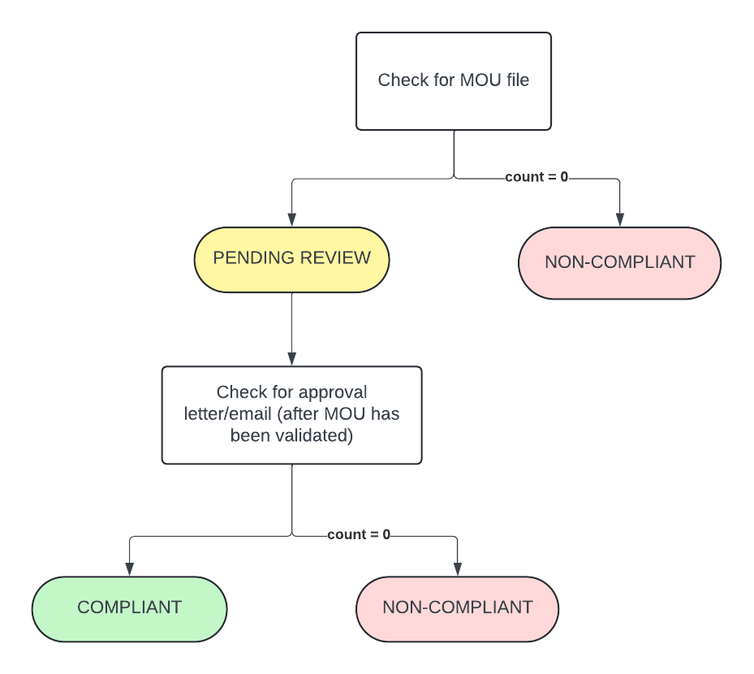

# Guardrail #10 - Cyber Defense Services

Establish a memorandum of understanding for defensive services and threat-monitoring protection services.

## Mandatory Validations

- [ ] Confirm with the Cyber Centre that the memorandum of understanding has been signed
- [ ] Confirm that the Cyber Centre’s sensors or other cyber defence services are implemented where available

## Additional Considerations

None

## Policies

### Validation 01 - Verify Memorandum of Understanding (MOU) has been Signed

- [10_01-mou.rego](../../policies/10-cyber-defense-services/10_01-mou.rego)

Ensure that the memorandum of understanding (MOU) has been signed.

Signed MOU is to be uploaded to attestation `guardrail-10` folder.

**COMPLIANT** if MOU uploaded to `guardrail-10` folder AND it has been reviewed and received approval. Approval is to be uploaded to `guardrail-10/validations` and filename must begin with *01_APPROVAL* (i.e. `01_APPROVAL_email.pdf`)

**PENDING** status if MOU has been uploaded/provided but approval have not been given.

**NON-COMPLIANT** if MOU has not been uploaded/provided

#### Policy Flow Diagram

### Validation 02 - Verify Cyber Defense Services Implemented Where Available

- [10_02-cyber-defense.rego](../policies/10-cyber-defense-services/10_02-cyber-defense.rego)

Ensure that Cyber Centre's sensors or other cyber defense services are implemented.

Check (in CBS project) that each components in the sensor's deployment exists:
- Pub/Sub topics & subscriptions
- Cloud Run jobs & functions
- GCS buckets

*NOTE* at time of writing, Pathfinding is the proposed CBS solution and may/may not be GA yet.

**COMPLIANT** if all required services with the expected naming prefixes (*cbs-*) are found.

**NON-COMPLIANT** if any individual required resource is not found.  One non-compliant message outlining the expected item that is missing.

#### Policy Flow Diagram

