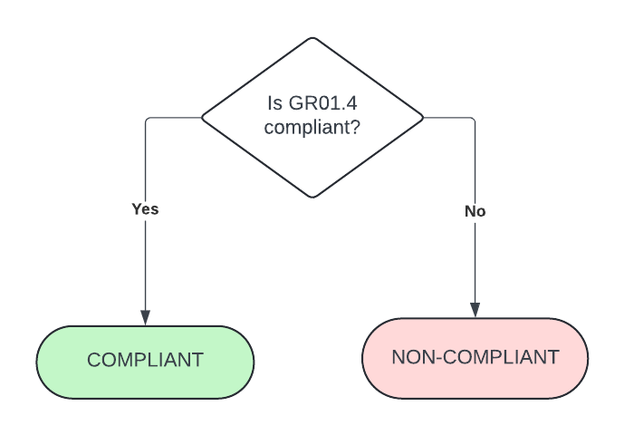
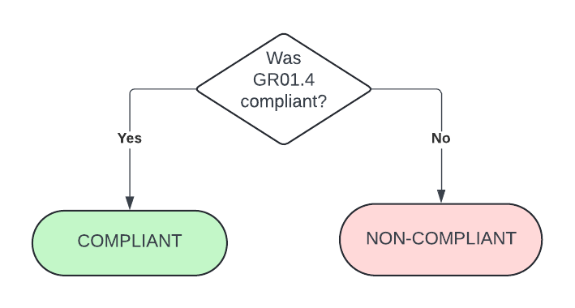
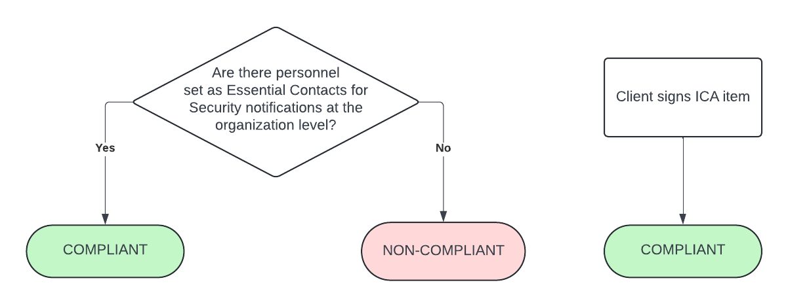
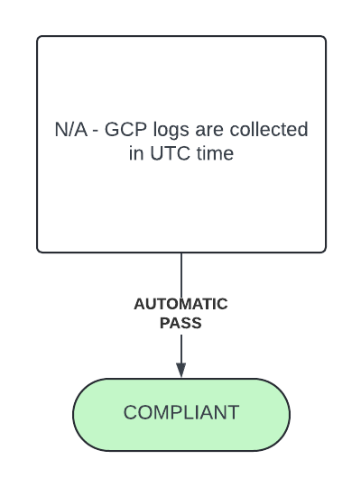
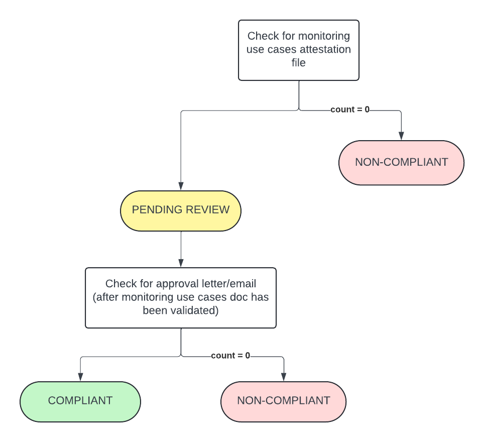

# Guardrail #11 -  Logging and Monitoring

Enable logging for the cloud environment and for cloud-based workloads.

## Mandatory Validations

- [ ] Confirm policy for event logging is implemented.
- [ ] Confirm that the following logs are included:
  - Sign-in logs (interactive and non-interactive sign-ins, API sign-ins)
  - Access privilege and group changes (including group membership and group privilege assignment)
  - Changes in configuration of the cloud platform
  - Cloud resource provisioning activities.
- [ ] Confirm whether monitoring and auditing is implemented for all users.
- [ ] Confirm that the security contact record within the account should be completed with the details of at least two appropriate information security personnel (if multiple personnel are permitted by the cloud platform).
- [ ] Confirm that the appropriate time zone has been set.
- [ ] Demonstrate that the monitoring use cases for the cloud platform have been implemented and have been integrated with the overall security monitoring activities being performed by the department (evidence could include monitoring a checklist or a system generated report).                                                                                                            |

## Additional Considerations

None

## Policies

### Validation 01 - Verify Policy for Event Logging is Implemented
### Validation 02 - Verify Essential Logs are Included

- [11_0102-event-logging.rego](https://github.com/ssc-spc-ccoe-cei/gcp-cac-policies/11-logging-and-monitoring/11_0102-event-logging.rego)

Ensure the folloiwng logs are included:
- sign-ins
- access privilege & group changes
- GCP configuration changes
- GCP resource provisioning activities

*NOTE* this is the equivalent of GR1.4

**COMPLIANT** if Google Workspace logs are found in Cloud Logging (other logs: Admin Activity, System Event, and Policy Denied audit logs are always written and cannot be disabled).

**NON-COMPLIANT** if no Google Workspace logs are found in Cloud Logging.

#### Policy Flow Diagram

### Validation 03 - Verify Whether Monitoring & Auditing is Implemented for All Users

- [11_03-monitoring-and-auditing.rego](https://github.com/ssc-spc-ccoe-cei/gcp-cac-policies/11-logging-and-monitoring/11_03-monitoring-and-auditing.rego)

Validate whether monitoring & auditing has been implemented for all users.

*NOTE* this is the equivalent of GR1.4

**COMPLIANT** if Google Workspace logs are found in Cloud Logging (other logs: Admin Activity, System Event, and Policy Denied audit logs are always written and cannot be disabled).

**NON-COMPLIANT** if no Google Workspace logs are found in Cloud Logging.

#### Policy Flow Diagram

### Validation 04 - Verify Essential Contacts have been Configured

- [11_04-essential-contacts.rego](https://github.com/ssc-spc-ccoe-cei/gcp-cac-policies/11-logging-and-monitoring/11_04-essential-contacts.rego)

Validate there are at least two (2) information security personnel on the security contact record.

*NOTE*: ICA also required to be signed to attest/acknowledge that IT security personnel being added.

**COMPLIANT** if 2 or more essential contacts were assigned under the "SECURITY" category.

**NON-COMPLIANT** if less than 2 essential contacts were assigned under the "SECURITY" category.

#### Policy Flow Diagram

### Validation 05 - Verify Appropriate Time Zone for Logs have been Set

Validate logs are collected using a common time zone.

**COMPLIANT** by default.  GCP logs are collected in UTC time.

#### Policy Flow Diagram

### Validation 06 - Verify Monitoring Use Cases for GCP have been Implemented and Integrated with Security Monitoring Activities

- [11_06-monitoring-use-cases.rego](https://github.com/ssc-spc-ccoe-cei/gcp-cac-policies/11-logging-and-monitoring/11_06-monitoring-use-cases.rego)

Validate that the monitoring use cases for GCP have been implemented and demonstrate that it has been integrated with overall security monitoring activities.

Document(s) containing monitoring use cases have been uploaded to attestation `guardrail-11` folder.

Document(s) must be reviewed and approved.

**COMPLIANT** if document(s) uploaded to `guardrail-11` folder AND it has been reviewed and received approval. Approval is to be uploaded to the root of the Google Cloud Storage bucket and filename must begin with *GUARDRAIL_APPROVAL* (i.e. `GUARDRAIL_APPROVAL_email.pdf`)

**PENDING** status if document(s) have been uploaded/provided but approval have not been given.

**NON-COMPLIANT** if document(s) have not been uploaded/provided.

#### Policy Flow Diagram

