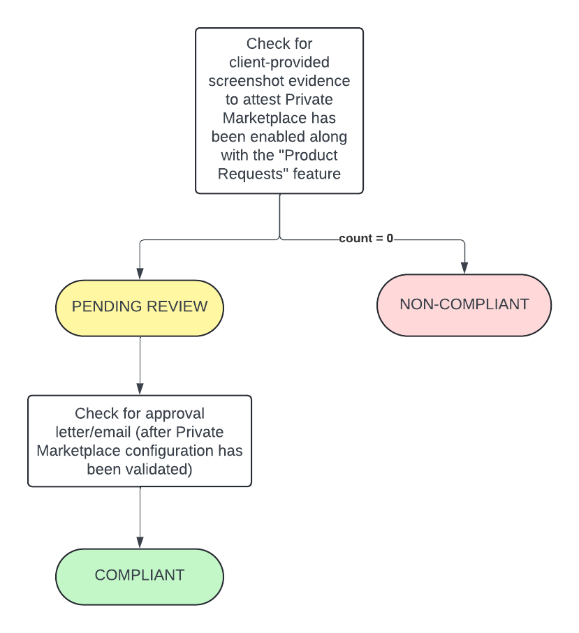

# Guardrail #12 - Configuration of Cloud Marketplaces

Restrict Third-Party CSP Marketplace software to GC-approved products.

## Mandatory Validations

- [ ] Confirm that third-party marketplace restrictions have been implemented

## Additional Considerations

None

## Policies

### Validation 01 - Verify Third-party Marketplace Restrictions have been Implemented

- [12_01-private-marketplace.rego](../policies/12-market-place/12_01-private-marketplace.rego)

Validate third-party marketplace use is only from GC-approved products.

Configuration data cannot be queried programmatically and screenshot needs to be uploaded to attestation `guardrail-12` folder.

**COMPLIANT** if screenshot(s) uploaded to `guardrail-12` folder AND it has been reviewed and received approval. Approval is to be uploaded to `guardrail-12/validations` and filename must begin with *01_APPROVAL* (i.e. `01_APPROVAL_email.pdf`)

**PENDING** status if screenshot(s) have been uploaded/provided but approval have not been given.

**NON-COMPLIANT** if screenshot(s) have not been uploaded/provided.

#### Policy Flow Diagram

