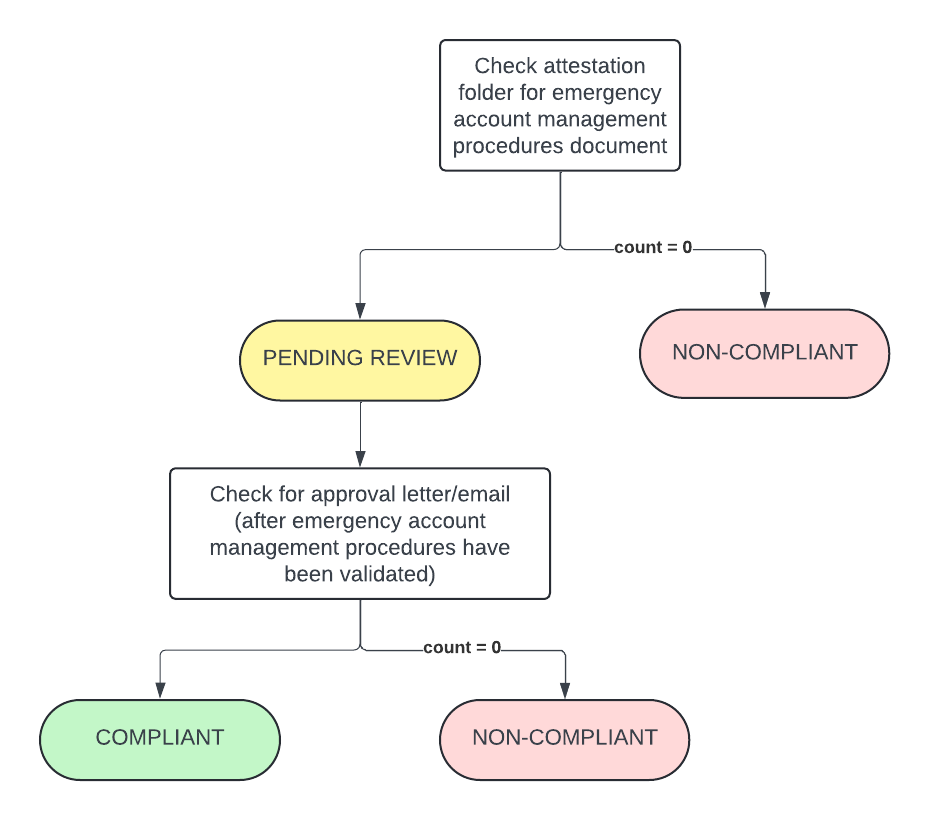
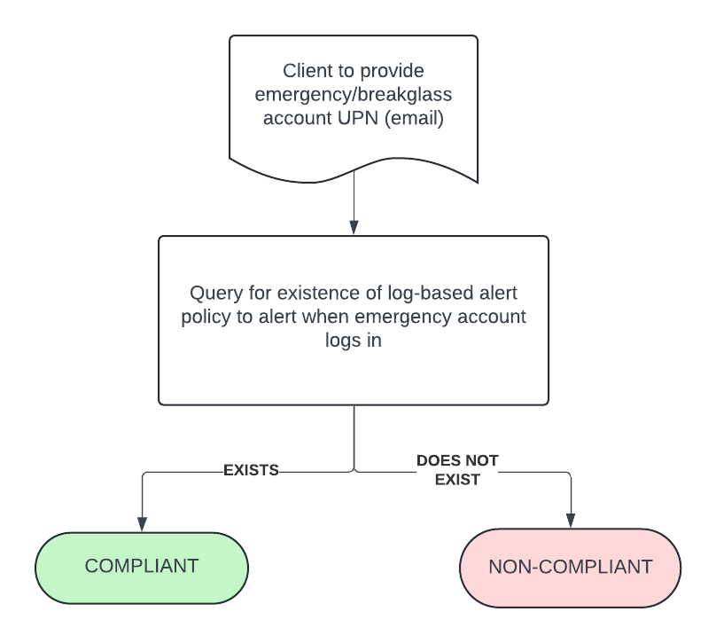
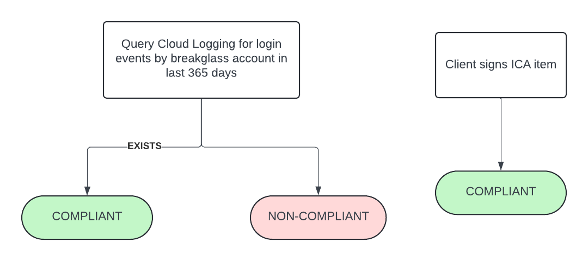
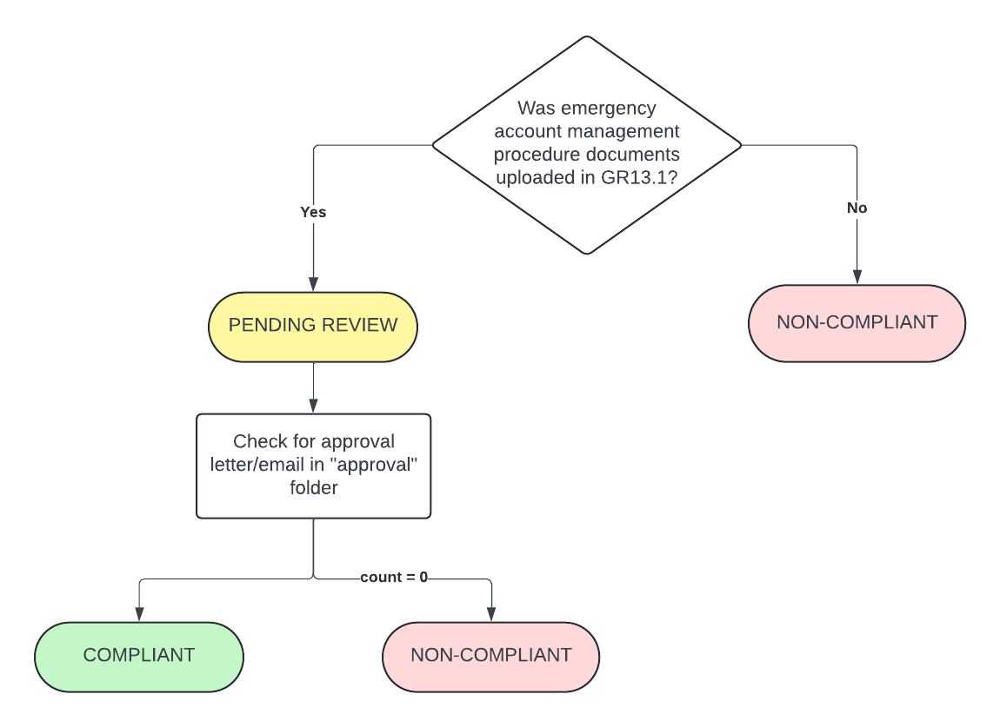

# Guardrail #13: Plan for Continuity

Ensure that there is a plan for continuity of access and service that accommodates both expected and unexpected events.

## Mandatory Validations

- [ ] Verify that an emergency account management procedure has been developed
- [ ] Verify that alerts are in place to report any use of emergency accounts
- [ ] Verify that testing of emergency accounts took place, and that periodic testing is included in emergency account management procedures.
- [ ] Confirm through attestation that the departmental CIO, in collaboration with the DOCS, has approved the emergency account management procedure for the cloud service.

## Additional Considerations

- [ ] Confirm through attestation that the cloud backup strategy is developed and approved by the business owner.
- [ ] Verify if there are scripts that support the ability to restore from code (for example, infrastructure as code).
- [ ] Provide a list of all software, including versions, deployed on virtual machines associated with the Application IDs from the APM.

## Policies

### Validation 01 - Verify Emergency Account Procedure

- [13_01-emergency-account-procedure.rego](../policies/13-plan-for-continuity/13_01-emergency-account-procedure.rego)

Ensure that an emergency account management procedure has been created.

Document(s) containing emergency account management procedure required to be uploaded to attestation `guardrail-13` folder.

**COMPLIANT** if document(s) uploaded to `guardrail-13` folder AND it has been reviewed and received approval. Approval is to be uploaded to `guardrail-13/validations` and filename must begin with *01_APPROVAL* (i.e. `01_APPROVAL_email.pdf`) 

**PENDING** status if document(s) have been uploaded/provided but approval have not been given.

**NON-COMPLIANT** if document(s) have not been uploaded/provided.

#### Policy Flow Diagram

### Validation 02 - Verify Alerts for Emergency Account Usage are In Place

- [13_02-emergency-account-alerts.rego](../policies/13-plan-for-continuity/13_02-emergency-account-alerts.rego)

Ensure that alerts are in place to report any emergency account .

A GCP Alert Policy is required to be setup to report on any emergency account usage (logins).

**COMPLIANT** if a log-based Alert Policy exists which filters on `protoPayload.authenticationInfo.principalEmail` for the emergency account UPN/email

**NON-COMPLIANT** if Alert Policy does not exist OR policy does not filter on required field

#### Policy Flow Diagram

### Validation 03 - Verify Periodic Emergency Account Testing is Being Conducted

- [emergency-account-testing.rego](../policies/13-plan-for-continuity/13_03-emergency-account-testing.rego)

Ensure that an emergency account management procedure has been created.

Document(s) containing emergency account management procedure required to be uploaded to attestation `guardrail-13` folder.

**COMPLIANT** if emergency account UPN/email is found in logging data.  Timestamp(s) of login will be provided in policy output.

*NOTE*: ICA also required to be signed to attest/acknowledge the requirement and that testing is taking place.

**NON-COMPLIANT** if no log entry involving emergency account login was found.

#### Policy Flow Diagram

### Validation 04 - Verify Emergency Account Procedure received CIO Approval

- [13_04-dept-cio-approval.rego](../policies/13-plan-for-continuity/13_04-dept-cio-approval.rego)

Ensure that an emergency account management procedure has been created.

Document(s) containing emergency account management procedure required to be uploaded to attestation `guardrail-13` folder.

Document(s) must be reviewed and approval needs to be provided by CIO.

**COMPLIANT** if document(s) uploaded to `guardrail-13` folder AND it has been reviewed and received approval. Approval is to be uploaded to `guardrail-13/validations` and filename must begin with *04_APPROVAL* (i.e. `04_APPROVAL_email.pdf`) 

**PENDING** status if document(s) have been uploaded/provided but approval have not been given.

**NON-COMPLIANT** if document(s) have not been uploaded/provided (this should have been uploaded for GR13.1)

#### Policy Flow Diagram

