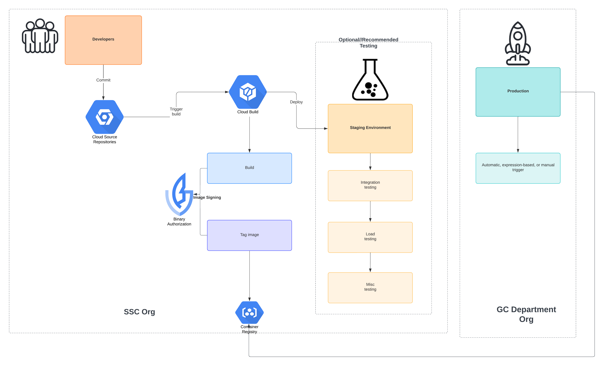

# Compliance as Code Toolkit

This repository contains the application artifacts for the Compliance-as-Code(CaC) tool for SSC.

<!-- TOC start -->
- [Compliance as Code Toolkit](#compliance-as-code-toolkit)
  - [Preparing the GCP Environment](#preparing-the-gcp-environment)
    - [Setting up Binary Authorization](#setting-up-binary-authorization)
    - [Adding the code to Cloud Source Repositories](#adding-the-code-to-cloud-source-repositories)
    - [Setup Cloud Build Triggers](#setup-cloud-build-triggers)
  - [Building and Testing the CaC Solution application](#building-and-testing-the-cac-solution-application)
    - [Importing new OPA images](#importing-new-opa-images)
  - [Gitflow Tagging](#gitflow-tagging)
<!-- TOC end -->

Initial setup of the container build pipeline and associated tooling is required prior to client deployment of CaC in their environment. This repository contains the application code, and associated pipeline files to setup a Cloud Build pipeline for the container image.
The CaC Solution toolkit leverages a Service Account along with several Google Cloud Platform services to create all the necessary resources as well as access the required information in a GCP Organization.

Included in this repository is a script that can be leveraged to setup all of the pre-requisites, including:

- Service Account creation, including Roles
- Project API enablement
- Service Identity Creation, including Roles



The CaC tool container image build setup requires the following GCP Services:

**Service Account Permissions**

--

|IAM Role                    | Description                    | Usage                                                         |Tier           |Resource Level |
|----------------------------|--------------------------------|---------------------------------------------------------------|---------------|---------------|
|Role Viewer                 |roles/iam.roleViewer            |Allows the Service Account to list the SA roles being granted. |Infrastructure |Project        |
|Storage Admin               |roles/storage.admin             |Allows the Service Account to create buckets and objects.      |Infrastructure |Project        |
|Cloud Scheduler Admin       |roles/cloudscheduler.admin      |Allows the Service Account to create a new cloud scheduler job.|Infrastructure |Project        |
|Cloud Run Developer         |roles/run.developer             |Allows the Service Account to create Cloud Run services.       |Infrastructure |Project        |
|Cloud Run Invoker           |roles/run.invoker               |Allows the Service Account to trigger Cloud Run on a Schedule  |Infrastructure |Project        |
|Logs Viewer                 |roles/logging.viewer            |Allows the Service Account to read Cloud Audit Logs            |Application    |Organization   |
|Security Center Admin Viewer|roles/securitycenter.adminViewer|Allows the Service Account to list findings and alerts in SCC  |Application    |Organization   |
|Cloud Asset Viewer          |roles/cloudasset.viewer         |Allows the Service Account to list cloud asset inventory.      |Application    |Organization   |

**Project APIs**

--

|GCP API/Service        |Description                        |Usage                                                          |Tier           |
|-----------------------|-----------------------------------|---------------------------------------------------------------|---------------|
|Cloud Run              |"run.googleapis.com"               |PaaS Environment; runs the CaC Solution Container Image        |Infrastructure|
|Container Registry     |"containerregistry.googleapis.com" |Cloud Run dependency service                                   |Infrastructure|
|Cloud Scheduler        |"cloudscheduler.googleapis.com"    |Used to trigger CaC Solution on a schedule                     |Infrastructure|
|Cloud Storage          |"storage.googleapis.com"           |Necesary for uploads of Compliance Data, and storage of results|Infrastructure|
|Cloud Asset Inventory  |"cloudasset.googleapis.com"        |Used to query provisioned GCP infrastructure                   |Application|
|Security Command Center|"securitycenter.googleapis.com"    |Used to query provisioned GCP infrastructure                   |Application|
|Cloud Storage Transfer |"storagetransfer.googleapis.com"   |Used to transfer Compliance results output files               |Application|

## Preparing the GCP Environment

Run the `install.sh` script found in the `deployment/application` directory. The script will prompt for the GCP organization name and use it to provision the Service Account and enable all of the required APIs
Once the script has completed, continue on to the sections below to complete the initial setup for Binary Authorization, as well as configuring the build triggers for each component.

### Setting up Binary Authorization

1) Create a KMS Keyring and Key:

```bash
BUILD_PROJECT=
gcloud config set project $BUILD_PROJECT
PROJECT_ID="$(gcloud config get-value project)"
KEY_RING="cac-signing-key-ring"
KEY="cac-signing-key"
gcloud kms keyrings create $KEY_RING --location northamerica-northeast1
gcloud kms keys create $KEY --location northamerica-northeast1 --keyring $KEY_RING --purpose asymmetric-signing --default-algorithm rsa-sign-pss-2048-sha256
gcloud kms keys list --location northamerica-northeast1 --keyring $KEY_RING
```

2) Create an Attestor in the GCP Console:

      <https://console.cloud.google.com/security/binary-authorization/attestors/create>

      PKIX key, which you can import the KMS key.  Note the "name" in the `gcloud kms keys list --location northamerica-northeast1 --keyring $KEY_RING` command.  You'll need to append `/cryptoKeyVersions/1` at the end of it to  meet the required format.

### Adding the code to Cloud Source Repositories

In order to add the artifacts in this repository to Cloud Source, you will need to configure access to Cloud Source. The following commands will allow you to use your Google Identity with the `git` cli tool to interact with the Source Repos:

1) Add the container image files to the repository:

```bash
 #Clone the Repo
 gcloud source repos clone cac_container_image  

 #Copy files to repo folder

 cp -r ssc-slz-compliance-python/* cac_container_image/
 cd cac_container_image

 #configure git credentials for this repository
 cac_container_image git:(main) ✗ git config user.email <gcp email>
 cac_container_image git:(main) ✗ git config user.name <name>

 #commit the files
 cac_container_image git:(main) ✗ git commit -m "Initial Commit"

> Hint:  If you're using Windows, enter the following command:

gcloud init && git config credential.helper gcloud.cmd

> Hint: If you're using Linux or macOS, enter the following command:

gcloud init && git config credential.helper gcloud.sh
```

### Setup Cloud Build Triggers

In the [buildfiles](../../../buildfiles/) directory there are 2 cloudbuild configuration files:

- [pythonapp-cloudbuild.yaml](../../../buildfiles/pythonapp-cloudbuild.yaml): Builds the CaC data collector application, and deploys it for testing to CloudRun.
- [opa-cloudbuild.yaml](../../../buildfiles/opa-cloudbuild.yaml): Pulls the public image from Dockerhub and imports it to artifact registry.

Create Cloud Build **PUSH** Triggers for the Python Application container images:

```bash

source buildfiles/collector_config
BUILD_PROJECT=
APP_REPO_NAME=
gcloud config set project $BUILD_PROJECT

gcloud builds triggers create cloud-source-repositories \
--name="python-app-image-build" \
--repo=${APP_REPO_NAME}\
--branch-pattern=main \
--build-config=buildfiles/pythonapp-cloudbuild.yaml \
--service-account=${SERVICE_ACCOUNT} \
--region "${REGION}" \
--substitutions=^+^\
_IMAGE_TAG="${IMAGE_TAG}"+\
_POLICY_REPO="${POLICY_REPO}"+\
_BRANCH="${BRANCH}"+\
_REGION="${REGION}"+\
_POLICY_VERSION="${POLICY_VERSION}"+\
_OPA_IMAGE="${OPA_IMAGE}"+\
_GCS_BUCKET="${GCS_BUCKET}"+\
_PROJECT_ID="${PROJECT_ID}"+\
_SERVICE_ACCOUNT="${SERVICE_ACCOUNT}"+\
_ORG_NAME="${ORG_NAME}"+\
_ORG_ID="${ORG_ID}"+\
_GC_PROFILE="${GC_PROFILE}"+\
_DOMAIN="${DOMAIN}"+\
_SECURITY_CATEGORY_KEY="${SECURITY_CATEGORY_KEY}"+\
_PRIVILEGED_USERS_LIST="${_PRIVILEGED_USERS_LIST}"+\
_REGULAR_USERS_LIST="${_REGULAR_USERS_LIST}"+\
_ALLOWED_DOMAINS="${ALLOWED_DOMAINS}"+\
_DENY_DOMAINS="${DENY_DOMAINS}"+\
_HAS_GUEST_USERS="${HAS_GUEST_USERS}"+\
_ALLOWED_CIDRS="${ALLOWED_CIDRS}"+\
_CUSTOMER_IDS="${CUSTOMER_IDS}"+\
_CA_ISSUERS="${CA_ISSUERS}"+\
_APP_PORT="${APP_PORT}"

```

**NOTE:** SERVICE_ACCOUNT is of the format `project/PROJECT_ID/serviceAccounts/FULL_SA_EMAIL` (i.e. projects/myproject123/serviceAccounts/my_sa_user@myproject123.iam.gserviceaccounts.com) and POLICY_REPO is the Cloud Source Repositories repo name (**just** the name)

Create Cloud Build **MANUAL** Trigger for the Python Application:

```bash

source buildfiles/collector_config

gcloud builds triggers create manual \
--name="python-app-image-build" \
--repo-type="CLOUD_SOURCE_REPOSITORIES" \
--repo=${POLICY_REPO} \
--branch="${BRANCH}" \
--build-config=buildfiles/pythonapp-cloudbuild.yaml \
--service-account=${SERVICE_ACCOUNT} \
--region "${REGION}" \
--substitutions=^+^\
_IMAGE_TAG="${IMAGE_TAG}"+\
_POLICY_REPO="${POLICY_REPO}"+\
_BRANCH="${BRANCH}"+\
_REGION="${REGION}"+\
_POLICY_VERSION="${POLICY_VERSION}"+\
_OPA_IMAGE="${OPA_IMAGE}"+\
_GCS_BUCKET="${GCS_BUCKET}"+\
_PROJECT_ID="${PROJECT_ID}"+\
_SERVICE_ACCOUNT="${SERVICE_ACCOUNT}"+\
_ORG_NAME="${ORG_NAME}"+\
_ORG_ID="${ORG_ID}"+\
_GC_PROFILE="${GC_PROFILE}"+\
_DOMAIN="${DOMAIN}"+\
_SECURITY_CATEGORY_KEY="${SECURITY_CATEGORY_KEY}"+\
_PRIVILEGED_USERS_LIST="${_PRIVILEGED_USERS_LIST}"+\
_REGULAR_USERS_LIST="${_REGULAR_USERS_LIST}"+\
_ALLOWED_DOMAINS="${ALLOWED_DOMAINS}"+\
_DENY_DOMAINS="${DENY_DOMAINS}"+\
_HAS_GUEST_USERS="${HAS_GUEST_USERS}"+\
_ALLOWED_CIDRS="${ALLOWED_CIDRS}"+\
_CUSTOMER_IDS="${CUSTOMER_IDS}"+\
_CA_ISSUERS="${CA_ISSUERS}"+\
_APP_PORT="${APP_PORT}"
```

Create a Cloud Build **MANUAL** trigger for the OPA Container image

```bash
BUILD_PROJECT=
APP_REPO_NAME=
OPA_VERSION=
REGION=
SERVICE_ACCOUNT=

gcloud config set project $BUILD_PROJECT

gcloud builds triggers create manual \
--name="opa-image-build" \
--repo-type="CLOUD_SOURCE_REPOSITORIES" \
--repo=${APP_REPO_NAME}\
--branch-pattern=main \
--build-config=buildfiles/opa-cloudbuild.yaml \
--service-account=${SERVICE_ACCOUNT} \
--region="${REGION}" \
--substitutions=_OPA_VERSION="$OPA_VERSION",\
_REGION="${REGION}"\
_PROJECT_ID="${BUILD_PROJECT}"
```

**NOTE:** APP_FULL_REPO_NAME is of the format: `https://source.developers.google.com/PROJECT_ID/REPO_NAME`

## Building and Testing the CaC Solution application

The deploy stage of  `python-app` build requires a number of variable substitutions that are used to test both the application and the policies:

| Name                      | Description                                                                   | Example                   |
|---------------------------|-------------------------------------------------------------------------------|---------------------------|
| `_SERVICE_ACCOUNT`        |Name of the Service Account to use for Deployment                              |`cac-dev-37505682288-sa`|
| `_ORG_NAME`               |GCP Organization Name                                                          | `example.ca`|
| `_GC_PROFILE`             |Cloud Usage Profile                                                            |`1`|
| `_SECURITY_CATEGORY_KEY`  |Tag used to identify Privileged Data                                           |`SECURITY_CATEGORY`|
| `_PRIVILEGED_USERS_LIST`  |List of users with Privileged Access                                           |`user:admin-user1@example.ca,user:admin-user2@example.ca`|
| `_REGULAR_USERS_LIST`     |Regular IDs of Privileged Users                                                |`user:user1@example.ca,user:user2@example.ca`|
| `_ALLOWED_DOMAINS`        |List of user domains with GCP access enabled                                   |`ssc.gc.ca`|
| `_DENY_DOMAINS`           |List of user domains that should not have GCP access                           |`outlook.com,gmail.com`|
| `_HAS_GUEST_USERS`        |Binary flag used to indicate if Guest Users have been added                    |`False`|
| `_ALLOWED_CIDRS`          | List of CIDR Blocks allowed to access the GCP environment                     |`10.0.0.0/8,192.168.1.0/24`|
| `_CUSTOMER_IDS`           |List of GCP Org and/or Workspace Customer IDs                                  |`CUSTOMER_IDS='C03xxxx4x,Abc123,XYZ890`|
| `_CA_ISSUERS`             |List of Acceptable Certifcate Authorities                                      |`"Let's Encrypt,Verisign"`|
| `_POLICY_REPO`            |URL of Source Control repository hosting the CaC Policies                      |"https://source.developers.google.com/p/gcp-cac-solution-build/r/cac_policies"`|
| `_REGION`                 |GCP Region to deploy to                                                        |`northamerica-northeast1`|
| `_OPA_IMAGE`              |URL of OPA Container Image                                                     |`"northamerica-northeast1-docker.pkg.dev/cacv2-devproj/opa/opa:0.70.0"`|
|`_ARTIFACT_REPOSITORY_NAME`  | The name of the Google Artifact registry used to store the container image    | `cac_repo`                |
|`_ATTESTOR_NAME`             | The name of the Binary Authorization Attestor to use when signing the image   | `cac-attestor`            |
|`_IMAGE_NAME`               | The name to use as the final container image name                             | `cac-opa-python`          |
|`_KEY_NAME`                | The name of the CloudKMS key used to sign the container image                 | `signing-key`             |
|`_KEY_VERSION`               | The version number of the CloudKMS key                                        | `1`                       |
|`_KEYRING_NAME`             | The name of the CloudKMS keyring that houses the signing key                  | `signing-keyring`         |
|`_REGION`                    | the Artifact registry location                                                |  `northamerica-northeast1`|

To build a new version of the python application:

```bash
source buildfiles/collector_config

gcloud config set project $BUILD_PROJECT
PROJECT_ID="$(gcloud config get-value project)"

gcloud builds triggers run python-app-image-build \
--region "${REGION}" \
--substitutions=^+^\
_IMAGE_TAG="${IMAGE_TAG}"+\
_POLICY_REPO="${POLICY_REPO}"+\
_BRANCH="${BRANCH}"+\
_REGION="${REGION}"+\
_POLICY_VERSION="${POLICY_VERSION}"+\
_OPA_IMAGE="${OPA_IMAGE}"+\
_GCS_BUCKET="${GCS_BUCKET}"+\
_PROJECT_ID="${PROJECT_ID}"+\
_SERVICE_ACCOUNT="${SERVICE_ACCOUNT}"+\
_ORG_NAME="${ORG_NAME}"+\
_ORG_ID="${ORG_ID}"+\
_GC_PROFILE="${GC_PROFILE}"+\
_DOMAIN="${DOMAIN}"+\
_SECURITY_CATEGORY_KEY="${SECURITY_CATEGORY_KEY}"+\
_PRIVILEGED_USERS_LIST="${_PRIVILEGED_USERS_LIST}"+\
_REGULAR_USERS_LIST="${_REGULAR_USERS_LIST}"+\
_ALLOWED_DOMAINS="${ALLOWED_DOMAINS}"+\
_DENY_DOMAINS="${DENY_DOMAINS}"+\
_HAS_GUEST_USERS="${HAS_GUEST_USERS}"+\
_ALLOWED_CIDRS="${ALLOWED_CIDRS}"+\
_CUSTOMER_IDS="${CUSTOMER_IDS}"+\
_CA_ISSUERS="${CA_ISSUERS}"+\
_APP_PORT="${APP_PORT}"+\
_POLICY_PROJECT="${POLICY}"

```

### Importing new OPA images

The `opa` builds take the image tag (version) as an environment variable. This allows SSC to control what versions of the application components are available for consumption.
They can be run from the GCP CloudBuild Console, or using the gcloud command.

To import a new version of the OPA image:

```bash
BUILD_PROJECT=
gcloud config set project $BUILD_PROJECT
PROJECT_ID="$(gcloud config get-value project)"

gcloud builds triggers run opa-image-build \
--region northamerica-northeast1 \
--substitutions=_OPA_VERSION="0.70.0",\
_REGION="northamerica-northeast1",\
_PROJECT_ID="${PROJECT_ID}" 
```

Because the application is deployed with a side-car architecture, if you want to update any component  you will first need to submit a Cloud Build job to update the side-car image versions first before submitting the application's Cloud Build pipeline to release the updated (overall) app.

Updating and Testing OPA:

```bash
BUILD_PROJECT=
gcloud config set project $BUILD_PROJECT
PROJECT_ID="$(gcloud config get-value project)"

gcloud builds triggers run opa-image-build \
--region northamerica-northeast1 \
--substitutions=_OPA_VERSION="0.70.0",\
_REGION="northamerica-northeast1",\
_PROJECT_ID=$PROJECT_ID  

gcloud builds triggers run pythonapp-image\
--region northamerica-northeast1 \
--substitutions=gcloud builds triggers run python-app-image-build --region ${REGION} \
--substitutions=^+^_IMAGE_TAG="${IMAGE_TAG}"+\
_POLICY_REPO="${POLICY_REPO}"+\
_BRANCH="${BRANCH}"+\
_REGION="${REGION}"+\
_POLICY_VERSION="${POLICY_VERSION}"+\
_OPA_IMAGE="${OPA_IMAGE}"+\
_GCS_BUCKET="${GCS_BUCKET}"+\
_PROJECT_ID="${PROJECT_ID}"+\
_SERVICE_ACCOUNT="${SERVICE_ACCOUNT}"+\
_ORG_NAME="${ORG_NAME}"+\
_ORG_ID="${ORG_ID}"+\
_GC_PROFILE="${GC_PROFILE}"+\
_DOMAIN="${DOMAIN}"+\
_SECURITY_CATEGORY_KEY="${SECURITY_CATEGORY_KEY}"+\
_PRIVILEGED_USERS_LIST="${_PRIVILEGED_USERS_LIST}"+\
_REGULAR_USERS_LIST="${_REGULAR_USERS_LIST}"+\
_ALLOWED_DOMAINS="${ALLOWED_DOMAINS}"+\
_DENY_DOMAINS="${DENY_DOMAINS}"+\
_HAS_GUEST_USERS="${HAS_GUEST_USERS}"+\
_ALLOWED_CIDRS="${ALLOWED_CIDRS}"+\
_CUSTOMER_IDS="${CUSTOMER_IDS}"+\
_CA_ISSUERS="${CA_ISSUERS}"+\
_APP_PORT="${APP_PORT}"+\
_POLICY_PROJECT="${POLICY}"
```

## Gitflow Tagging

Generally performed as part of a release, tagging is a simple way of marking the code at that particular release point:

```bash
git tag -a v1.0 -m "This is GCP CaC v1.0"
```